# Arrowz

**English** · [Polski](README.pl.md)

Arrowz is a puzzle. You get a rectangle packed with arrows, and you have to
clear it — one arrow at a time, in the right order. This repository holds the
part that makes the puzzles: a **board generator**, plus a command-line tool
and a small web page for using it.

This page is written for someone who has never seen the project. No programming
knowledge is assumed. If a word needs explaining, it is explained where it
first appears.

<p align="center">
  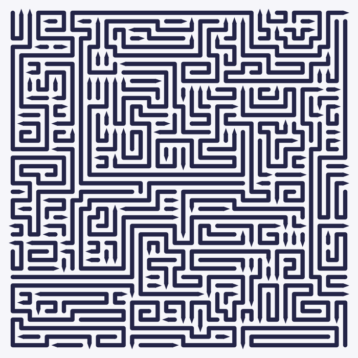
</p>

---

## Contents

1. [The puzzle in one minute](#the-puzzle-in-one-minute)
2. [What the generator promises](#what-the-generator-promises)
3. [Getting the tool running](#getting-the-tool-running)
4. [The commands](#the-commands)
5. [The everyday settings](#the-everyday-settings)
6. [The full set of settings](#the-full-set-of-settings)
7. [The web page](#the-web-page)
8. [Where boards are saved](#where-boards-are-saved)
9. [When something goes wrong](#when-something-goes-wrong)
10. [Word list](#word-list)
11. [Where things live](#where-things-live)

---

## The puzzle in one minute

### What you are looking at

A board is a grid of small squares. Every square is covered by an arrow, and no
square is left empty. An arrow is a line that walks from square to square —
only up, down, left or right, never diagonally, and never across itself. One
end of the line has a pointed tip. That tip is the front of the arrow, and it
says which way the arrow wants to go.

Here is an eight-by-eight board with each arrow in its own colour, so you can
tell them apart:

<p align="center">
  
</p>

Seven arrows, seven tips. The green one is bent into a hook, the red one is
bent twice, the purple one is just two squares long. Arrows can be as short as
two squares or as long as several hundred.

Real boards use one colour for everything, because telling the arrows apart by
eye is the whole point of the game:

<p align="center">
  
</p>

### The one rule

You tap an arrow. It tries to drive straight out of the board, in the direction
its tip points.

Picture a narrow lane starting just in front of the tip and running in a
straight line to the edge of the board. That lane is the only thing that
matters.

**If the lane is clear, the arrow drives out and disappears.**

<p align="center">
  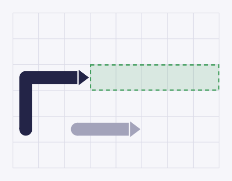
</p>

The dark blue arrow points right. The dashed lane in front of it is empty, so
the arrow leaves the board. The grey arrow further down is irrelevant — it is
not in the lane.

**If anything is standing in the lane, the move is not allowed.** The arrow
lurches forward, bumps into whatever is in the way, slides back to where it
started, and you lose a life. The bump is deliberate: it shows you what blocked
you.

<p align="center">
  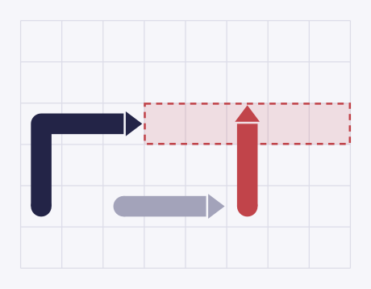
</p>

Here the red arrow is parked across the lane, so the blue arrow cannot go
anywhere.

The part that trips everyone up: **the shape of an arrow does not matter, only
its lane.** An arrow bent into a horseshoe with another arrow sitting inside
the bend is still free to leave — that other arrow is not in the lane.

<p align="center">
  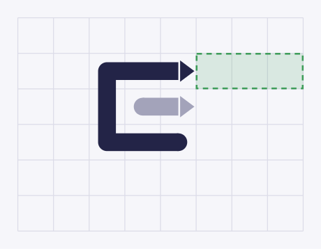
</p>

The blue arrow curls around the grey one, but its lane, the dashed strip, is
clear. Tap it and it goes.

The reason this works is that an arrow travels along its own body. The tip
moves one square forward, and every square behind it shuffles up into the space
just vacated. The arrow never crosses a square it does not already occupy. That
is why its curves and hooks make no difference to whether it can move.

### Winning and losing

You win when the board is empty. You lose when you run out of lives — the
design gives the player three.

You can never get stuck. As long as arrows remain on the board, at least one of
them is always free to leave, and clearing a free arrow never traps the rest.
The difficulty is entirely in *seeing* which arrow is free. Tapping blindly is
what costs you.

> **Note.** The playable game — tapping, lives, score — is designed but not
> built yet. What lives in this repository is the machine that produces the
> boards, and the tools for looking at what it produces.

---

## What the generator promises

Every board the generator hands back has been checked. It guarantees:

| Promise | What it means for you |
|---|---|
| **Nothing is left over** | Every square belongs to exactly one arrow. No gaps, no overlaps. |
| **No arrow is a single square** | The shortest arrow is two squares, because a single square would have no direction to point in. |
| **The board can always be cleared** | Before handing the board over, the generator works out who blocks whom and proves the puzzle has a solution. |
| **It knows at least one solution** | The order in which the generator built the arrows is itself a winning order. |
| **You cannot play yourself into a corner** | Any sequence of legal moves eventually empties the board. |
| **The same request gives the same board** | Ask twice with the same settings and the same seed number, and you get the identical board, down to the last square. |

One thing it does **not** promise: that every request succeeds. On hard
settings the generator can paint itself into a corner while building. When that
happens, it undoes some of its work and tries again. If that still fails, it
starts over from scratch, up to a few times. If every attempt fails, it says so
plainly instead of handing you a broken board.

---

## Getting the tool running

### Installing Deno

**[Deno](https://deno.com/) version 2.9 or newer.** That is the whole list.
Deno is a single program that runs the code in this repository. There is
nothing else to install and no separate download step.

On macOS or Linux:

```sh
curl -fsSL https://deno.land/install.sh | sh
```

On Windows (PowerShell):

```powershell
irm https://deno.land/install.ps1 | iex
```

Check it worked:

```sh
deno --version
```

### Getting the code

```sh
git clone https://github.com/Fronthub-pl/arrowz.git
cd arrowz
```

Run every command on this page from inside that `arrowz` folder.

### Making your first board

```sh
deno task carve --width=25 --height=25 --svg
```

The first time you run this, Deno spends a few seconds fetching the two small
helper libraries it needs. After that a 25×25 board takes well under a second.

The board lands in `packages/cli/boards/25x25/` as three files: the board itself
(`.board.json`, the file the game reads), a small text file describing it
(`.json`) and, because of `--svg`, a picture (`.svg`). Open the picture in any
browser.

### Five things to try

Copy any of these. Each one writes a board into `packages/cli/boards/`; add
`--svg` to get a picture of it as well, or `--dry-run` (explained below) to see
the numbers without writing a file. Every flag used here is explained in
[The everyday settings](#the-everyday-settings).

```sh
# small enough to follow every arrow by eye
deno task carve --width=12 --height=12 --colored

# a dense field of tiny arrows
deno task carve --width=40 --height=40 --length=0 --colored

# a few long snakes instead
deno task carve --width=40 --height=40 --length=1 --winding=0 --colored

# long highways crossing the whole board
deno task carve --width=80 --height=80 --skeleton --colored

# a tall board, which is harder to play than a square one
deno task carve --width=40 --height=80
```

### Checking that everything works

```sh
deno task test
```

This runs the project's own set of checks, including nine reference boards
that must come out pixel-identical every time. It takes about half a minute.
You do not need to run it to use the tool; it is there if you want to be sure
nothing is broken.

### Making a standalone program

If you would rather have a single file you can run without Deno being involved
every time:

```sh
deno task compile
```

That writes a self-contained program to `packages/cli/dist/carve`. It takes
exactly the same options as the `carve` task, and is shorter to type:

```sh
./packages/cli/dist/carve --width=25 --height=25 --dry-run
```

One catch. The standalone program does not know where the repository is, so it
cannot work out where to file boards. Before asking it to save anything, tell
it where to put them:

```sh
export ARROWZ_BOARDS_DIR=~/arrowz-boards
./packages/cli/dist/carve --width=25 --height=25
```

Without that, saving fails with an error about a directory it cannot create.
Asking it to describe a board rather than save one (`--dry-run`, below) works
either way.

---

## The commands

Everything runs through the `carve` task, one dialect: the everyday flags and
the engine's own knobs stand side by side on the same command line. There is
no switch that changes what a flag means.

It prints its own instructions:

```sh
deno task carve --help          # the short form: everyday flags, output, picture
deno task carve --help=knobs    # the full table: every knob, its range and default
```

### Making a board

```sh
deno task carve --width=40 --height=40 --seed=7
```

Writes two files into `packages/cli/boards/40x40/`:

* `seed7-f48ddb0f.board.json` — the board: every arrow, cell by cell, packed
  small. This is the file a game loads.
* `seed7-f48ddb0f.json` — a small text file recording what was asked for.

The name is the seed number plus a short code worked out from the settings. Two
boards made with different settings therefore never overwrite each other.

### Getting a picture as well

```sh
deno task carve --width=40 --height=40 --svg
deno task carve --width=40 --height=40 --svg=my-board.svg
```

`--svg` adds `seed7-f48ddb0f.svg` next to the board. `--svg=my-board.svg` does
the same and also drops a copy at `my-board.svg`.

### Making many boards at once

```sh
deno task carve --width=100 --height=200 --seed=1 --count=50
```

Makes 50 boards on the seeds 1, 2, 3 and so on. A seed whose board does not
close is skipped (and not saved), and the next seed is tried, until there are
50. After twice as many seeds as boards it gives up; `--max-seeds=200` moves
that limit. The last line says how many boards were written and which seeds
were skipped. The same command always makes the same boards.

### Describing a board without saving it

```sh
deno task carve --width=30 --height=30 --seed=7 --dry-run
```

Builds the board, writes nothing, and prints one line of text describing it, in
a format meant for programs rather than people. Trimmed to the interesting
parts:

```json
{
  "W": 30, "H": 30, "seed": 7,
  "ok": true,
  "pieces": 87,
  "avgLen": 10.34,
  "maxLen": 44,
  "solvable": true,
  "genMs": 11,
  "pinned": [],
  "command": "deno task carve --width=30 --height=30 --seed=7"
}
```

Read that as: the board was built successfully, it holds 87 arrows, the average
arrow is 10.3 squares long, the longest is 44, the puzzle has a solution, and
the whole thing took 11 milliseconds. `command` is the command that reproduces
it. `pinned` lists any knob you named yourself on the command line — empty
here, because this run used only everyday flags; see
["When a knob meets an everyday flag"](#when-a-knob-meets-an-everyday-flag) below.

This is the fastest way to try a setting: you see how many arrows you get and
how long it took, without a single file on disk.

### When a board does not close

Rarely, at large sizes, the generator gives up before every square is covered.
The board is still saved, the description says `"ok": false`, and the command
exits with code 1 so that scripts notice. Add `--svg` and the picture shows
the uncovered squares tinted pink. A run that is taking too long can be cut
short:

```sh
CARVE_TIMEOUT_S=60 deno task carve --width=1000 --height=1000
```

That stops after a minute and saves whatever was drawn by then, marked
`"aborted": true`.

### Printing the measurements report

```sh
deno task report --only=easy --square --runs=1
```

A separate command, `deno task report`, builds boards at a chosen size and
prints a page of measurements about them. This one is a diagnostic tool for
people tuning the generator, not something you need to read. Real output:

```
--- Easy 25x25 (1 runs) ---
  coverage      100.00%   solvable: YES
  pieces        72   length 2..42
  length dist.  2-6: 63%  7-15: 22%  16-49: 15%  50+: 0.0%
  ...
  time          generation 22 ms, metrics 2 ms
```

The two lines worth knowing: `coverage 100.00%` means no square was left
uncovered, and `solvable: YES` means the puzzle can be finished.

With no `--only` it walks through every difficulty level in turn, up to
1000×1000, which takes a long time. `--bench=N` measures speed instead, N runs
per level.

### Asking for something impossible

The generator refuses settings it knows will not work before it starts, not
after ten minutes of grinding:

```sh
deno task carve --width=30 --height=30 --pstraight=0.2 --svg=/tmp/x.svg
```

```
invalid parameters:
  - straightness bias: 0.2 is outside 0.6..1
see --help for the allowed ranges
```

The command ends with status code 2. A status code is a number a program leaves
behind when it finishes, and scripts read it to learn how things went: 0 means
everything went fine, 1 means the generator gave up, and 2 means you asked for
something out of range.

---

## The everyday settings

Twelve flags in four groups: two for size, one for luck, four that change the
puzzle, and five that change only how the picture is drawn.

### Size — `--width` and `--height`

How many squares across and down. Both are required. Anything from 4 to 1000.

A 400×400 board is ready in under two seconds; 1000×1000 takes about ten. A
tall board is harder to play than a square one with the same number of squares,
because arrows have further to travel.

| `--width=20 --height=40` | `--width=100 --height=100` |
|---|---|
| 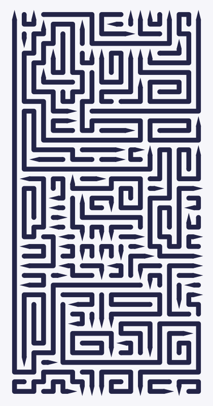 | 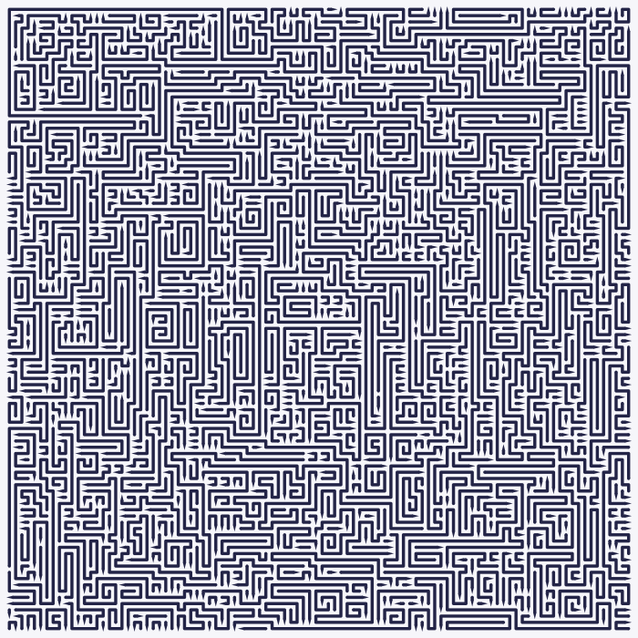 |

### How big a board can get

The ceiling is 1000×1000 — a million squares. Past roughly two hundred squares
a side the arrows stop being individually visible on screen, and the board
turns into fabric. All three below are shown at the same width here; only the
real size differs.

| 200×200 | 500×500 | 1000×1000 |
|---|---|---|
| 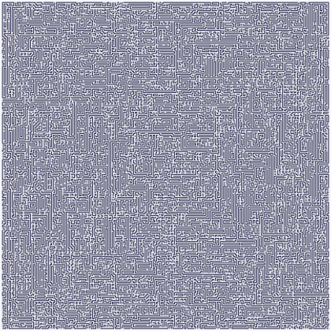 | 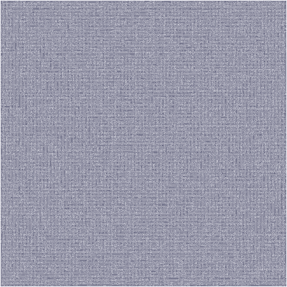 | 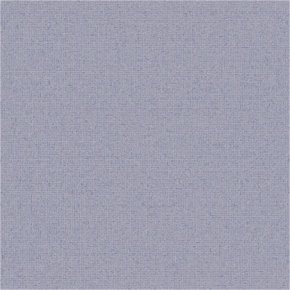 |
| **3,619 arrows**, 0.2 s | **21,771 arrows**, 1.4 s | **85,809 arrows**, 9.6 s |

Nothing about the puzzle changes at that size. Here is a thirty-by-thirty
window into the million-square board, drawn at the same zoom as the 30×30
boards in the comparisons below — the same picture, just one part of a much
bigger one:

<p align="center">
  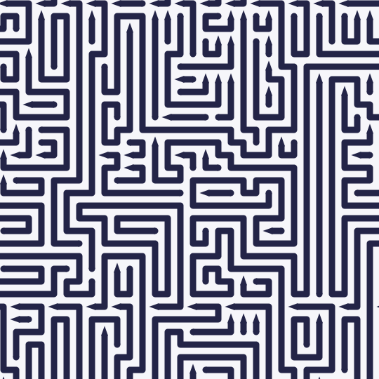
</p>

Two things are worth noticing in the numbers. The average arrow barely grows
with the board — 11.1 squares at 200×200 against 11.7 at 1000×1000 — so a
bigger board buys you more arrows rather than longer ones. The single longest
arrow does grow: 213 squares, then 278, then 354.

Unlike the smaller examples, these three are not stored here as drawings you
can download. Their files run to 0.9 MB, 7 MB and 22 MB, which is more than
belongs in a repository. Make your own with one command:

```sh
deno task carve --width=1000 --height=1000 --seed=7 --svg=huge.svg
```

### Seed — `--seed`

A number from 0 to 999999 that picks which board you get. With everything else
unchanged, the same seed always gives the same board. A different seed gives a
different board of the same character. Default: 7.

| `--seed=7` | `--seed=42` |
|---|---|
| 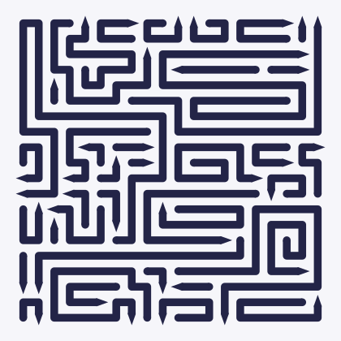 | 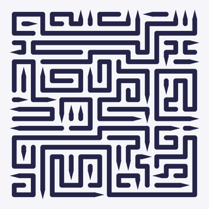 |

### Arrow length — `--length`

An option from 0 to 1. Default: `0.75`.

Turn it **down** and the board fills with short arrows: many of them, each with
its own tip, packed together like a field of little hooks. Turn it **up** and
the board is made of a few long snakes with tips few and far between.

Measured on a 30×30 board with seed 7:

| `--length=0` | default (`0.75`) | `--length=1` |
|---|---|---|
| 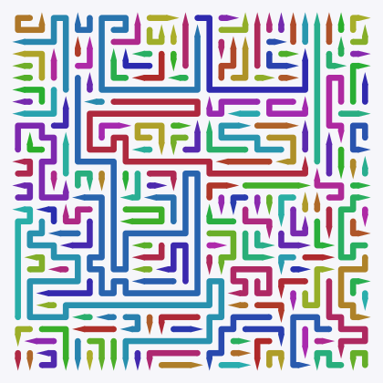 |  | 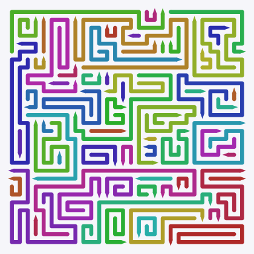 |
| **176 arrows**, average 5.1 squares | **87 arrows**, average 10.3 squares | **65 arrows**, average 13.9 squares |

More arrows is not automatically harder — it is a different kind of hard. Short
arrows give you many things to look at; long arrows give you fewer but each one
reaches further and blocks more.

### Line shape — `--winding`

An option from 0 to 1. Default: `0.5`. It controls how eagerly a line keeps
going straight instead of turning: `0` is the straightest a board gets, `1` is
the most winding.

Turn it **down** and arrows run in long straight strokes. Turn it **up** and
they wriggle, turning every few squares and worming into small pockets.

| `--winding=0` (straightest) | default (`0.5`) | `--winding=1` (most winding) |
|---|---|---|
|  |  | 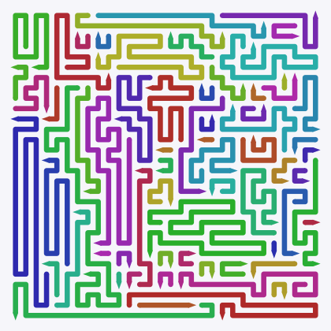 |
| 49 arrows, 2.1 turns each | 87 arrows, 3.2 turns each | 66 arrows, 5.5 turns each |

Worth noticing: pushing this option to either extreme gives you *fewer* arrows
than the middle. Straight lines run further before they stop; winding lines
swallow more squares per arrow while filling in corners. The busiest boards are
the ones in between.

### Backbone — `--skeleton`

An on/off switch, off by default. Switch it on and the generator first lays
down a handful of very long lines — highways zig-zagging across the whole
board. Then it fills the channels between them with ordinary arrows.

| without | `--skeleton` |
|---|---|
| 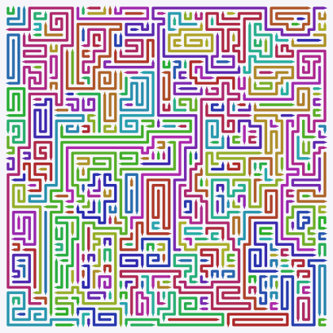 | 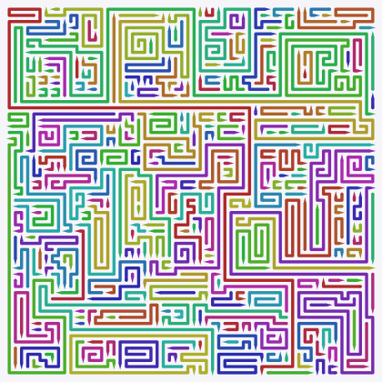 |
| 337 arrows, longest 103 squares | 291 arrows, longest **168** squares |

This is the only way to get genuinely long arrows. Left to itself the generator
rarely produces one that crosses the entire board.

### Fresh luck every time — `--randomized`

Normally an option's position means one exact recipe. With `--randomized`,
each option's position is treated as a *range*, and the generator draws a
fresh value from inside it on every run.

The practical effect: with this switch on, the same seed gives you a different
board every time. That extra roll of the dice is not controlled by the seed.

Nothing is lost. The settings that were actually drawn are written into the
board's text file as a full command, so any board you like can be reproduced
exactly.

```sh
deno task carve --width=40 --height=40 --randomized
```

Naming one of the internal knobs (below) alongside `--randomized` pins that one
knob and leaves the rest still being drawn — see
["When a knob meets an everyday flag"](#when-a-knob-meets-an-everyday-flag).

### How the picture is drawn

These five change nothing about the puzzle — only how it looks on screen.

**`--colored`** gives every arrow its own colour. Useless for playing,
excellent for understanding. Every comparison picture on this page uses it.

| normal | `--colored` |
|---|---|
|  | 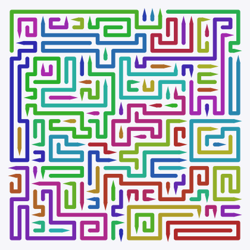 |

**`--line`** is how thick the lines are, as a fraction of one square. Default
`0.5`, meaning a line fills half its square.

| `--line=0.2` | `--line=0.9` |
|---|---|
| 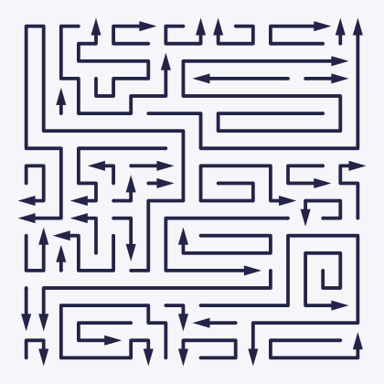 | 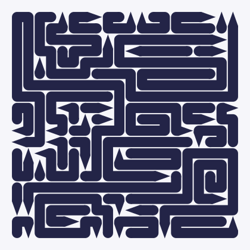 |

Note what happens to the tips. On a thin line the tip is a proper triangle,
wider than the line. Once the line gets thick, there is no room for a wider
triangle, so the tip becomes a sharpened point instead.

**`--arrow-width`** and **`--arrow-height`** size the tips by hand, measured in
squares. They behave differently. `--arrow-width` defaults to `auto`, meaning
"work it out from the line thickness"; a number instead is a width in squares.
`--arrow-height` has no such automatic mode — it is always taken literally, and
it defaults to `1`, one whole square. Ask for `--arrow-height=0` and you get a
tip of no height at all.

| `--arrow-width=0.6 --arrow-height=0.6` | `--arrow-width=2 --arrow-height=2` |
|---|---|
| 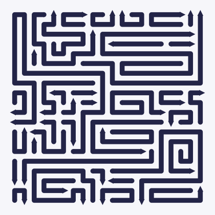 | 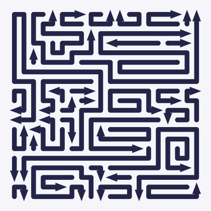 |

**`--sharp`** takes the rounding off. Normally a line turns a corner in a
curve and its blunt end is a rounded cap; with `--sharp` the corners are
angular and the blunt end is a square.

---

## The full set of settings

The twelve everyday flags are shortcuts. Behind each of them sit several
internal knobs, and you can reach any of them directly, on the same command
line as the everyday flags — there is no separate mode to switch into. Turning
`--length` down, for instance, really means "raise the share of short arrows
and lower the share of medium ones" — two knobs at once.

You do not need this section to use the tool. It is here because the question
"what does this knob actually do" deserves an answer. The everyday ones are
called options on this page; the internal ones behind them are called knobs.

```sh
deno task carve --width=40 --height=40 --seed=7 --pstraight=0.95 --svg
```

That is the whole of it: name a knob and it takes over from whichever everyday
flag would otherwise have set it. The next section says exactly what "takes
over" means when more than one knob shares an everyday flag.

### When a knob meets an everyday flag

An everyday flag is not a shortcut for one knob — it sets a whole *bundle* of
them:

| Everyday flag | Knobs it sets |
|---|---|
| `--length` | `wshort`, `wmid` |
| `--winding` | `pstraight`, `wlateral`, `warns`, `anticoil` |
| `--skeleton` | `giants`, `giantspan`, `giantstep`, `giantjitter`, `wgiant` |
| *(always, the difficulty baseline)* | half of `--start`, `probe`, `probelen` |

`--start` is its own small case of the same rule: it sets the difficulty-baseline
half above, plus the layers/tunnels mix that nothing else sets. Eight knobs —
`lmax`, `giantstraight`, `giantanticoil`, `giantspacing`, `headtries`,
`absorblimit`, `maxback`, `restarts` — sit in no bundle at all, so naming one of
those has never been ambiguous.

**A knob written on the command line wins, and pins only itself.** Without
`--randomized`, an everyday flag picks one value per knob in its bundle; naming
a knob yourself replaces that one value and leaves the rest of the bundle
exactly as the everyday flag would have set it. With `--randomized`, the
everyday flags draw their bundles from the measured safe ranges on every run;
a knob you name is **pinned** instead of drawn, while the rest of its bundle
keeps being drawn around it, seed after seed.

The CLI tells you when this happens, once per run, on stderr, and adds the
same fact to the `--dry-run` JSON so a script can see it without parsing
stderr:

```sh
deno task carve --width=30 --height=30 --randomized --pstraight=0.9 --dry-run
```

```
note: --pstraight=0.9 is pinned; --winding still sets wLateral, anticoil, warns
```

```json
{ "...": "...", "pinned": ["pStraight"], "...": "..." }
```

What you give up by pinning: the safe ranges in the table below were measured
as whole bundles, so a half-pinned bundle still stays inside the envelope, but
it is no longer covered by the promise that *every* everyday combination
closes. The envelope still has the last word — a pinned value outside its own
range, or a combination that breaks a rule, is refused exactly as it would be
otherwise.

### The knobs

All 25, grouped the way `deno task carve --help=knobs` groups them. Ranges
spell their word forms where one exists; `auto`, `random` and `off` are
explained where they appear. **Step** is the distance between the settings a
knob has: a value that lands between two of them is refused, the same as one
outside the range, because it is a value neither the slider on the web page
nor the printed command could reach again.

This table is not copied by hand — `readme.test.ts` compares its flag, range,
step and default against the ones the CLI prints, in both languages, so a
knob that moves has to move here too.

<!-- knob-table -->

| Group | Flag | Range | Step | Default | What it does |
|---|---|---|---|---|---|
| Board | `--width` | 4–1000 | 1 | `25` | Columns. Under two seconds up to 400×400; about ten seconds at 1000×1000. |
| Board | `--height` | 4–1000 | 1 | `50` | Rows. A tall board is harder to play than a square one with the same number of squares. |
| Board | `--seed` | 0–999999 | 1 | `7` | Picks the board. Same seed and same knobs, same board. |
| Lengths | `--wshort` | 0–0.9 | 0.01 | `0.2` | Share of short arrows (2–6 squares). Higher means more arrows and more tips, but the board turns into a mess of little hooks. Short plus medium together may not exceed 0.9. |
| Lengths | `--wmid` | 0–0.9 | 0.01 | `0.08` | Share of medium arrows (7–15 squares). Whatever is left over goes to long arrows. Short plus medium together may not exceed 0.9. |
| Lengths | `--lmax` | `auto`\|17–5000 | 1 | `auto` | The longest arrow the generator will attempt. `auto` means "two and a half times the longer side". **Careful:** below 17 the cap swallows both the medium and the long bucket, so the share between them stops changing the board. Use `auto`, or 17 and up. |
| Shape | `--pstraight` | 0.6–1 | 0.01 | `0.85` | How eagerly a line keeps going straight. Higher gives longer straight runs. **Careful:** the floor rises with the board. 0.6 closes 500×500, 600×600 needs 0.65, 800×800 needs 0.7 and 1000×1000 needs 0.8; a low `--warns` or a high `--anticoil` raises it further still. |
| Shape | `--wlateral` | 0–20 | 0.5 | `3` | How much a line prefers turning sideways over pushing deeper into open space. 0 gives long straight pushes and, occasionally, enormous spirals. |
| Shape | `--warns` | 2–16 | 1 | `4` | How eagerly a line fills awkward corners before they become dead ends. Higher gives fewer, longer, more curled-up arrows. **Careful:** 2 and 3 raise the straightness a large board needs; at 6 and up they lower it. |
| Shape | `--anticoil` | 1–10 | 1 | `6` | How hard a line tries not to touch itself. 1 turns it off; higher gives fewer spirals and slightly shorter arrows. **Careful:** 7 and up raise the straightness a large board needs; 4 and below lower it. |
| Difficulty | `--start` | `layers`\|`random`\|`tunnels`\|0.3–0.7 | - | `random` | Where the next arrow starts: the shallowest line (`layers`, easy: many arrows free at once), anywhere (`random`), or the deepest (`tunnels`, hard: few arrows free at once). A number in 0.3–0.7 mixes the two instead — the fraction of arrows that start as tunnels. |
| Difficulty | `--probe` | 0–1 | 0.01 | `0` | Share of arrows whose length is drawn around one fixed target instead of the usual three-way split. |
| Difficulty | `--probelen` | 4–200 | 1 | `12` | That fixed target, give or take half. 4 triples the number of arrows; 200 gives a few very long ones. Does nothing unless `--probe` is above 0. |
| Skeleton | `--giants` | 0–40 | 1 | `0` | How many of the first arrows are highways. 0 means none; 4 is a good starting point. Asking for many more is harmless but pointless: after the first two or three, later highways run out of room. |
| Skeleton | `--giantspan` | 1–200 | 1 | `30` | How long one highway aims to be, counted in lengths of the board's longer side. It stops early if it runs out of room. |
| Skeleton | `--giantstep` | `random`\|1–40 | 1 | `14` | The gap between the parallel runs of a highway. Small gives regular stripes like ruled paper; large gives a few sweeping highways; `random` lets it wander freely instead of running in a serpentine. |
| Skeleton | `--giantjitter` | 0–1 | 0.05 | `0.6` | How often a run stops short instead of going all the way to the obstacle. 0 gives perfectly straight, regular edges. |
| Skeleton | `--wgiant` | 0–0.2 | 0.01 | `0` | The chance that an arrow drawn later is also a highway. **Careful:** at 0.2 boards get slow and stop closing at 1000×1000. |
| Skeleton | `--giantstraight` | 0.5–1 | 0.01 | `0.94` | How straight a highway runs where it has free space. **Careful:** 0.5 is no preference at all; below it the knob would weigh a straight move down, which is not what its name says. |
| Skeleton | `--giantanticoil` | 1–20 | 1 | `6` | The self-touching penalty, for highways only. Whichever is higher, this or the general `--anticoil`, wins. |
| Skeleton | `--giantspacing` | `off`\|2\|3 | 1 | `2` | How many squares a highway keeps between its own parallel runs. `off` turns the rule off. The flag takes these three values and nothing else: a wider radius only cost time, so it is not offered. |
| Closing | `--headtries` | 2–16 | 1 | `4` | How many starting spots to try before giving up on a direction. **Careful:** at 2 the search is shallow for hard settings. At 8 and above you usually get the same board as at 4. |
| Closing | `--absorblimit` | 12–64 | 1 | `24` | A leftover patch up to this size that no arrow fits into gets glued onto a neighbouring arrow. **Careful:** near the bottom of the range, leftovers pile up and boards fail far more often. |
| Closing | `--maxback` | `auto`\|50–1000 | 50 | `auto` | How many drawn arrows may be undone in one attempt before starting over. `auto` means 200, which is enough; more rarely rescues anything — it just delays the bad news. |
| Closing | `--restarts` | 0–5 | 1 | `3` | How many fresh attempts, each with a nudged seed, after a failure. 0 shows you the raw success rate of your settings. |

Five knobs from an earlier version of this tool — `hug`, `edgehug`,
`strandlimit`, `giantwarns` and `giantspacepenalty` — are gone. Each did
nothing at its default, so removing it changes no board; each now lives in the
engine as a fixed constant instead of a flag.

### What some of these look like

Four knobs side by side, all on a 30×30 board with seed 7. Three of them
change the picture; the fourth changes something you cannot see.

**`--warns` — filling awkward corners first**

| `--warns=2` | `--warns=16` |
|---|---|
| 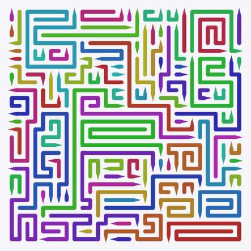 | 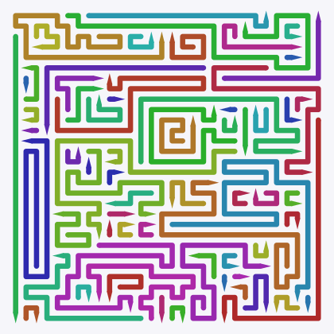 |
| 98 arrows, 2.4 turns each | 70 arrows, 3.8 turns each |

**`--wlateral` — turning sideways instead of pushing on**

| `--wlateral=0` | `--wlateral=20` |
|---|---|
| 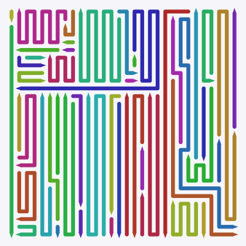 | 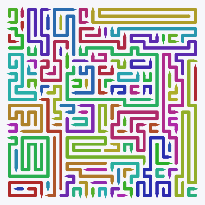 |
| 49 arrows, average 18.4 squares | 96 arrows, average 9.4 squares |

**`--probe` — one target length for every arrow**

| `--probe=1 --probelen=4` | `--probe=1 --probelen=200` |
|---|---|
| 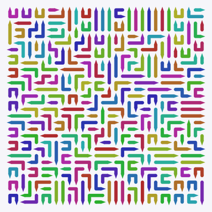 | 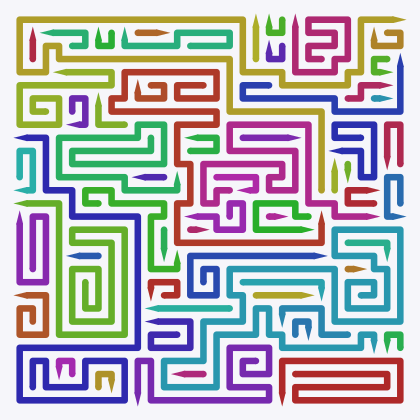 |
| 253 arrows, none longer than 4 squares | 61 arrows, longest 92 squares |

**`--start` — the knob you cannot see**

| `--start=layers` | `--start=tunnels` |
|---|---|
| 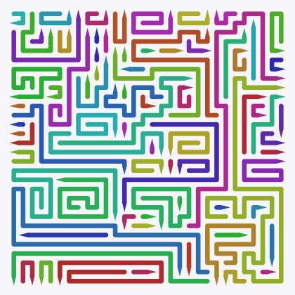 | 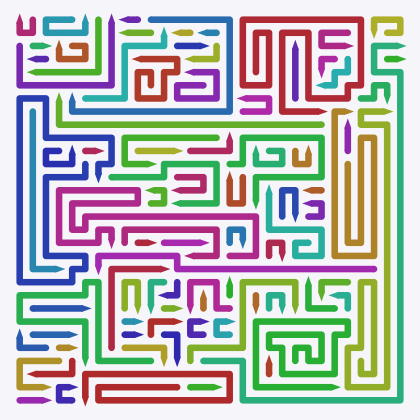 |
| 83 arrows, **34%** of them free to leave at the start | 90 arrows, only **6.7%** free at the start |

The last two pictures look much alike, and that is exactly the point. This
knob barely touches the drawing. What it changes is how many arrows are free
at any moment, and that is what makes a board easy or hard. At the default
(`--start=random`) the board sits between the two: 13% free. A number in
0.3–0.7 (`--start=0.3`…`--start=0.7`) mixes `layers` and `tunnels` instead of
choosing one: the number is the share of arrows that start as tunnels.

### Combinations that are refused

Four rules cannot be written as a simple from–to range, so they are checked
separately:

<!-- rule-table -->

| Flags | What is checked |
|---|---|
| `--wshort`, `--wmid` | Together they may not exceed 0.9, so at least a tenth of the arrows are long. |
| `--lmax` | `auto`, or 17 and up. |
| `--start` | A word (`layers`, `random`, `tunnels`) or a share in 0.3–0.7, and nothing else: a saved board whose start and mixing are a pair no `--start` can write is refused, because its command would rebuild a different board. |
| `--pstraight`, `--warns`, `--anticoil` | The straightness a board needs rises with its longer side — 0.6 up to 500×500, 0.65 at 600×600, 0.7 at 800×800, 0.8 at 1000×1000 — and `--warns` below 4, or `--anticoil` above 6, raises it further; a high `--warns` or a low `--anticoil` lowers it. Below the floor the board does not close, and the refusal names the number this board needs. |

Break a rule, put any knob outside its range, or land between two of its
steps, and the generator refuses before drawing anything, tells you which
value was wrong, and stops with status code 2. It never quietly rounds your
number into range: `--maxback=75` is refused rather than nudged to 50 or 100,
because a value no slider and no printed command can reach would make the
board unreproducible.

The everyday options cannot break these rules. They were built so that every
value of every everyday option, at every board size, produces a valid
combination — as long as you leave every knob in its bundle to be set by the
everyday flag; see ["When a knob meets an everyday
flag"](#when-a-knob-meets-an-everyday-flag) above for what pinning one costs.

---

## The web page

There is a small page for playing with the settings and seeing the result
immediately. The page draws the board with the board element, which needs Lit:
run `corepack enable pnpm && pnpm install` once at the top of the repository
before the first start. Then:

```sh
sh packages/cli/lab.sh
```

It builds the page, opens `http://localhost:8777/lab.html`, and keeps
rebuilding whenever a source file changes. Stop it with Ctrl+C. If 8777 is
already in use on your computer, put another number after the command: `sh
packages/cli/lab.sh 9000`.

The page has two modes, and a Polish/English switch.

**Simple** is the default: board size, two sliders (arrow length, line shape),
a backbone switch and the seed — the same choices as the plain command line.
**Advanced** shows every knob from the previous section, with a description of
each and a list of ready-made settings, from Easy 25×25 up to Insane 1000×1000.

Two things the page does that the command line does not. It shows you the exact
command that would reproduce whatever you are looking at, so you can copy it.
And it keeps a library of saved boards, so you can put one aside and come back
to it.

If you set a knob outside its safe range, the offending row turns red, the
reason appears next to it, and the Generate button stops working until you fix
it. The command stays on screen, so you can still copy rejected settings.

---

## Where boards are saved

By default, boards go into `packages/cli/boards/`, sorted into a folder per size:

```
packages/cli/boards/
  25x25/
    seed7-8796a4f9.board.json   the board
    seed7-8796a4f9.json         what it was made from
    seed7-8796a4f9.svg          the picture, only with --svg
  40x40/
    ...
```

The file name is the seed followed by a short code derived from the settings.
Change a setting and you get a different code, so nothing is overwritten by
accident. (Colours and line thickness are not part of the code, so changing
only those writes to the same file name and replaces the old files.)

Point it somewhere else with the `ARROWZ_BOARDS_DIR` variable:

```sh
export ARROWZ_BOARDS_DIR=~/arrowz-boards
deno task carve --width=25 --height=25
```

The `.json` file next to each board holds every setting used, when it was
made, how long it took, and how many arrows it has. It also holds a `command`
line that makes the same board again, exactly. If you keep only one thing from
a board, keep that line.

> Boards are not part of the repository. `packages/cli/boards/` is deliberately
> left out of it: a 1000×1000 board file is about a megabyte, and its picture
> tens of megabytes.

---

## When something goes wrong

**`deno task couldn't find deno.json`** — you are outside the project folder.
`cd` into the `arrowz` folder and try again.

**`Requires env access`** — you ran `deno run packages/cli/carve.ts` directly.
Deno refuses to let a program touch your files or settings unless told to. Use
the `carve` task, which grants exactly what is needed.

**`unknown flag --foo; see --help`** — the CLI does not recognise that flag at
all. Check the spelling against `--help` or `--help=knobs`.

**`--straight is gone: use --winding=R …`** (or `--advanced`, `--board`,
`--w`/`--h`, `--colorized`, `--lineweight`, `--headwidth`/`--arrowwidth`,
`--headheight`/`--arrowheight`, `--lateral`, `--absorb`, `--headbias`,
`--mix`) — an old spelling from before this tool had one mode. The message
names its replacement; use that instead.

**`invalid parameters: … is outside …`** — one of your values is out of range.
The message names the setting and the allowed range. Nothing was generated and
nothing was written.

**`failed to close board …`** — the generator tried, backed up, restarted, and
still could not fill the board. Almost always a setting marked **Careful:**
above. Move it back towards its default, or try another seed. The board is in
`packages/cli/boards/` all the same; add `--svg` and the picture shows the
uncovered squares tinted pink, so you can see where it got stuck.

**One board takes forever** — set `CARVE_TIMEOUT_S` to a number of seconds and
the generator stops there, saving whatever it had drawn:

```sh
CARVE_TIMEOUT_S=60 deno task carve --width=1000 --height=1000
```

**The report takes forever** — `deno task report` with nothing else walks
every difficulty level up to 1000×1000, three times each. Add `--only=easy
--square --runs=1`. Note that `--only=easy` on its own matches nothing: it
needs `--square` or `--portrait` alongside it.

**The web page shows nothing** — the page needs building first. `sh
packages/cli/lab.sh` does it for you; opening `lab.html` straight from your file
manager does not work.

**Wondering what it is doing** — set `CARVE_TRACE=1` and it reports progress as
it goes:

```sh
CARVE_TRACE=1 deno task carve --width=200 --height=200
```

```
    [trace] pieces 7000, remaining 2516, backtracks 0, 252 ms
```

---

## Word list

| Word used here | What it means |
|---|---|
| **arrow** | One line on the board, from two to several hundred squares long, with a pointed tip at one end. The code and the English web page call it a *piece*; the Polish page calls it an *element*. |
| **tip** | The pointed end of an arrow. It shows which way the arrow travels. The code calls it the *head*. |
| **lane** | The straight strip of squares from an arrow's tip to the edge of the board. If it is clear, the arrow can leave. The code calls it the *corridor*. |
| **free** | An arrow with a clear lane, which can be removed right now. |
| **seed** | A number that decides which board you get. Same seed and settings, same board. |
| **backbone** | A few very long arrows drawn first, crossing the whole board. The code calls them *giants* or the *skeleton*. |
| **layers / tunnels** | Two ways of deciding where the next arrow starts. Layers peel the board from the outside and make it easy; tunnels dig inward and make it hard. |
| **jam** | The generator painting itself into a corner while building, so no legal arrow can be added. |
| **safe range** | The measured limits of each setting. Outside them, boards stop working; the tool refuses rather than let you find out the slow way. |

---

## Where things live

| Path | What it is |
|---|---|
| `packages/engine/engine.ts` | The generator itself. Knows nothing about files or web pages. |
| `packages/cli/carve.ts` | The command-line tool. |
| `packages/cli/lab.html`, `lab-page.ts` | The web page. |
| `packages/*/*.test.ts` | The tests. |
| `docs/images/manifest.json` | The command behind every picture on this page; `deno task docs` draws them all again. |
| `packages/engine/HISTORY.md` | The engineering log: every measurement, every dead end, every decision, in detail. |
| `docs/superpowers/specs/` | The design documents, including the full rules of the game. |
| `packages/engine/` | The engine package (`@arrowz/engine`): generator, parameters, command parser, presets, dictionaries. |
| `packages/cli/` | The command-line tool, the board store and the lab page. |

Opening the repository in Claude Code runs `jbcontext index --silent` through the hooks in
`.claude/settings.json` (at the start and end of a session), and `.mcp.json`
starts `jbcontext mcp`. Both run a program installed on your machine, so read
them before you trust the folder.

The code under `packages/` started as a throwaway prototype written to settle
what makes a good board. It settled that, so it became the engine the game is
built on; the tag `v1.0.0-alpha.1` marks that point. The game itself, a
reusable board component and a new lab are built next to it in this
repository (see `docs/superpowers/specs/2026-09-09-monorepo-design.md`).
