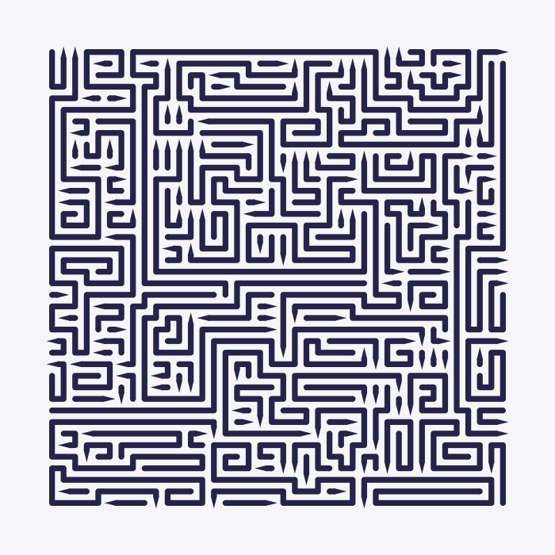
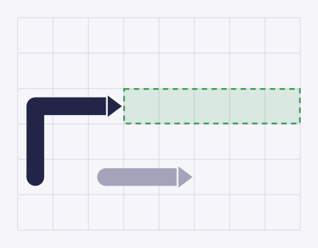
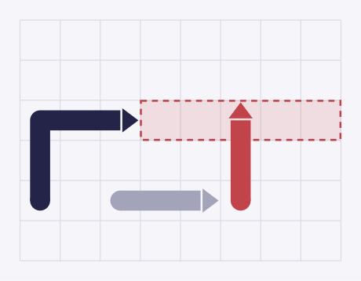
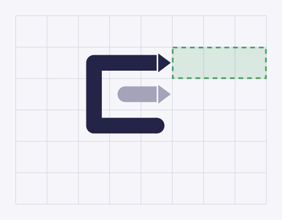

# Arrowz

[English](README.md) · **Polski**

Arrowz to łamigłówka. Masz przed sobą prostokąt wypełniony strzałkami i trzeba
go opróżnić — po jednej strzałce, we właściwej kolejności. W tym repozytorium
znajduje się ta część, która te łamigłówki wytwarza: **generator plansz**,
narzędzie wiersza poleceń i mała aplikacja do sterowania nim.

Ta strona jest napisana dla kogoś, kto widzi projekt pierwszy raz. Nie zakłada
żadnej wiedzy programistycznej. Jeśli jakieś słowo wymaga wyjaśnienia, jest
wyjaśnione tam, gdzie pojawia się po raz pierwszy.

<p align="center">
  
</p>

---

## Spis treści

1. [Łamigłówka w minutę](#łamigłówka-w-minutę)
2. [Co generator obiecuje](#co-generator-obiecuje)
3. [Uruchomienie narzędzia](#uruchomienie-narzędzia)
4. [Wiersz poleceń](#wiersz-poleceń)
5. [Laboratorium](#laboratorium)
6. [Kiedy coś nie działa](#kiedy-coś-nie-działa)
7. [Słowniczek](#słowniczek)
8. [Gdzie co leży](#gdzie-co-leży)

---

## Łamigłówka w minutę

### Co widzisz

Plansza to siatka małych komórek. Każda komórka jest zajęta przez strzałkę i
żadna nie zostaje pusta. Strzałka to linia, która wędruje z komórki do komórki
— tylko w górę, w dół, w lewo albo w prawo, nigdy na ukos i nigdy przez samą
siebie. Jeden koniec linii ma ostry grot. Grot to przód strzałki; pokazuje, w
którą stronę strzałka chce jechać.

Oto plansza osiem na osiem, każda strzałka w innym kolorze, żeby dało się je
odróżnić:

<p align="center">
  
</p>

Siedem strzałek, siedem grotów. Zielona jest zgięta w haczyk, czerwona zgina
się dwa razy, fioletowa ma raptem dwie komórki. Strzałka może mieć od dwóch do
kilkuset komórek długości.

Prawdziwe plansze są jednokolorowe, bo odróżnianie strzałek okiem to właśnie
sedno gry:

<p align="center">
  
</p>

### Jedyna reguła

Stukasz w strzałkę. Ona próbuje wyjechać prosto poza planszę, w stronę, w którą
wskazuje jej grot.

Wyobraź sobie wąską drogę, która zaczyna się tuż przed grotem i biegnie prosto
do krawędzi planszy. Liczy się tylko ta droga do krawędzi.

**Jeśli droga jest wolna, strzałka wyjeżdża i znika.**

<p align="center">
  
</p>

Granatowa strzałka wskazuje w prawo. Droga przed nią, zaznaczona przerywaną
linią, jest wolna, więc strzałka opuszcza planszę. Szara strzałka niżej nie ma
tu nic do rzeczy — nie stoi na drodze.

**Jeśli cokolwiek stoi na drodze, ruch jest niedozwolony.** Strzałka szarpie do
przodu, uderza w to, co jej zawadza, wraca na swoje miejsce, a ty tracisz
życie. To uderzenie jest celowe: pokazuje ci, co cię zablokowało.

<p align="center">
  
</p>

Tutaj czerwona strzałka stoi w poprzek drogi, więc granatowa nie ruszy się z
miejsca.

To, na czym potyka się każdy: **kształt strzałki nie ma znaczenia, liczy się
tylko jej droga do krawędzi.** Strzałka zgięta w podkowę, z obcą strzałką
siedzącą w środku zgięcia, nadal może swobodnie wyjechać — ta obca nie stoi na
drodze.

<p align="center">
  
</p>

Granatowa strzałka owija się wokół szarej, ale jej droga do krawędzi,
zaznaczona przerywaną linią, jest wolna. Stuknij, a pojedzie.

Działa to dlatego, że strzałka jedzie po własnym torze. Grot przesuwa się o
jedną komórkę do przodu, a reszta strzałki podąża za nim, komórka po komórce, w
miejsce, które się właśnie zwolniło. Strzałka nigdy nie wjeżdża na komórkę,
której sama nie zajmuje. Dlatego jej zakręty i haczyki nie mają żadnego wpływu
na to, czy może się ruszyć.

### Wygrana i przegrana

Wygrywasz, gdy plansza jest pusta. Przegrywasz, gdy skończą ci się życia —
projekt daje graczowi trzy.

Nie da się utknąć. Dopóki na planszy są strzałki, zawsze co najmniej jedna jest
wolna, a zdjęcie wolnej strzałki nigdy nie zapędza reszty w kozi róg. Cała
trudność polega na *dostrzeżeniu*, która strzałka jest wolna. Życia tracisz
tylko przez stukanie na oślep.

> **Uwaga.** Sama gra — stukanie, życia, punkty — jest zaprojektowana, ale
> jeszcze nie zbudowana. W tym repozytorium mieszka maszyna produkująca
> plansze i narzędzia do oglądania tego, co wyprodukuje.

---

## Co generator obiecuje

Każda plansza, którą generator oddaje, jest wcześniej sprawdzona. Gwarantuje:

| Obietnica | Co to dla ciebie znaczy |
|---|---|
| **Nic nie zostaje luzem** | Każda komórka należy dokładnie do jednej strzałki. Żadnych dziur, nic się nie nakłada. |
| **Żadna strzałka nie jest jedną komórką** | Najkrótsza ma dwie, bo pojedyncza komórka nie miałaby w którą stronę wskazywać. |
| **Planszę zawsze da się opróżnić** | Zanim odda planszę, generator wylicza, kto kogo blokuje, i dowodzi, że rozwiązanie istnieje. |
| **Zna co najmniej jedno rozwiązanie** | Kolejność, w jakiej sam budował strzałki, jest zwycięską kolejnością. |
| **Nie da się zapędzić w ślepy zaułek** | Dowolny ciąg dozwolonych ruchów prędzej czy później opróżnia planszę. |
| **To samo zamówienie daje tę samą planszę** | Poproś dwa razy o te same ustawienia i to samo ziarno, a dostaniesz identyczną planszę, co do komórki. |

Jednej rzeczy **nie** obiecuje: że każde zamówienie się uda. Przy trudnych
ustawieniach generator potrafi w trakcie budowania utknąć — zapędzić się w kozi
róg. Wtedy cofa część ułożonych strzałek i próbuje inaczej, a jeśli to nie
pomoże, zaczyna kilka razy od zera. Gdy wszystkie próby zawiodą, mówi to wprost,
zamiast podsunąć ci zepsutą planszę.

---

## Uruchomienie narzędzia

### Instalacja Deno

**[Deno](https://deno.com/) w wersji 2.9 lub nowszej.** To cała lista. Deno to
jeden program, który uruchamia kod z tego repozytorium; nie ma nic więcej do
instalowania i nie ma osobnego pobierania.

Na macOS albo Linuksie:

```sh
curl -fsSL https://deno.land/install.sh | sh
```

Na Windowsie (PowerShell):

```powershell
irm https://deno.land/install.ps1 | iex
```

Sprawdź, czy się udało:

```sh
deno --version
```

### Pobranie kodu

```sh
git clone https://github.com/Fronthub-pl/arrowz.git
cd arrowz
```

Każde polecenie z tej strony uruchamiasz z katalogu `arrowz`.

### Pierwsza plansza

```sh
deno task carve --width=25 --height=25 --svg
```

Za pierwszym razem Deno poświęci kilka sekund na ściągnięcie dwóch małych
bibliotek pomocniczych, których potrzebuje. Potem plansza 25×25 powstaje grubo
poniżej sekundy.

Plansza ląduje w `packages/cli/boards/25x25/` jako trzy pliki: sama plansza
(`.board.json`, plik, który czyta gra), mały plik tekstowy, który ją opisuje
(`.json`), i — dzięki `--svg` — obrazek (`.svg`). Obrazek otworzy dowolna
przeglądarka.

### Pięć rzeczy do wypróbowania

Skopiuj dowolne z tych poleceń. Każde zapisuje planszę w `packages/cli/boards/`;
dopisz `--svg`, żeby dostać też jej obrazek, albo `--dry-run` (opisane niżej),
żeby zobaczyć same liczby bez tworzenia pliku. Każdą użytą tu flagę objaśnia
sekcja [Ustawienia na co dzień](packages/cli/README.md#the-everyday-settings).

```sh
# na tyle mała, że da się prześledzić okiem każdą strzałkę
deno task carve --width=12 --height=12 --colored

# gęste pole malutkich strzałek
deno task carve --width=40 --height=40 --length=0 --colored

# zamiast tego kilka długich węży
deno task carve --width=40 --height=40 --length=1 --winding=0 --colored

# szkielet z bardzo długich strzałek przez całą planszę
deno task carve --width=80 --height=80 --skeleton --colored

# plansza pionowa, trudniejsza w grze od kwadratowej
deno task carve --width=40 --height=80
```

### Sprawdzenie, czy wszystko działa

```sh
deno task test
```

Uruchamia własny zestaw sprawdzeń projektu, w tym dziewięć plansz wzorcowych,
które muszą wyjść co do piksela tak samo za każdym razem. Zajmuje jakieś pół
minuty. Nie musisz tego uruchamiać, żeby korzystać z narzędzia; jest po to,
żeby mieć pewność, że nic się nie zepsuło.

---

## Wiersz poleceń

Polecenia, wszystkie ich ustawienia i miejsce, w którym lądują zrobione plansze,
opisuje [README wiersza poleceń](packages/cli/README.md) (po angielsku).

---

## Laboratorium

Mała aplikacja do zabawy ustawieniami i natychmiastowego oglądania wyniku,
razem z jego pomiarami, poleceniem, które go odtwarza, i biblioteką zapisanych
plansz. `pnpm nx serve lab` uruchamia ją pod `http://localhost:8779`; jak jej
używać, jej skróty klawiszowe, linki i zrzuty ekranu opisuje
[README laboratorium](apps/lab/README.md) (po angielsku).

---

## Kiedy coś nie działa

**`deno task couldn't find deno.json`** — jesteś poza katalogiem projektu.
Wejdź do katalogu `arrowz` i spróbuj jeszcze raz.

**`Requires env access`** — to znaczy, że `deno run packages/cli/carve.ts` zostało
uruchomione bezpośrednio. Deno nie pozwala programowi tknąć twoich plików ani
ustawień bez wyraźnej zgody. Używaj zadania `carve`, które nadaje dokładnie
tyle uprawnień, ile trzeba.

**`unknown flag --foo`** — CLI w ogóle nie rozpoznaje tej flagi.
Sprawdź pisownię w `--help` albo `--help=knobs`.

**`--straight is gone: use --winding=R …`** (albo `--advanced`, `--board`,
`--w`/`--h`, `--colorized`, `--lineweight`, `--headwidth`/`--arrowwidth`,
`--headheight`/`--arrowheight`, `--lateral`, `--absorb`, `--headbias`,
`--mix`) — stara pisownia sprzed czasów, gdy to narzędzie miało jeden tryb.
Komunikat nazywa zastępstwo — użyj go zamiast tego.

**`invalid arguments: --pstraight=0.2 is outside 0.6..1`** — któraś wartość jest
poza zakresem, leży między dwoma ustawieniami pokrętła albo łamie jedną z reguł.
Każdy wiersz zaczyna się od flagi do zmiany — niezależnie od tego, czy złapał ją
parser, czy koperta — a złamana reguła nazywa wszystkie flagi, których dotyczy.
Nic się nie policzyło i nic się nie zapisało.

**`failed to close board …`** — generator próbował, cofał się, zaczynał od nowa
i mimo to nie zdołał wypełnić planszy. Prawie zawsze chodzi o ustawienie
oznaczone wyżej jako **Uwaga:**. Cofnij je w stronę wartości domyślnej albo
zmień ziarno. Plansza mimo to jest w `packages/cli/boards/`; dopisz `--svg`, a
obrazek pokaże niepokryte komórki na różowo, więc widać, gdzie generator
utknął.

**`failed to close board …: covered, but the rays make a cycle`** — każda
komórka jest wypełniona, a i tak żadne stuknięcie nigdy nie jest dozwolone: dwie
strzałki wskazują na siebie albo robi to dłuższy ich pierścień. To błąd
generatora, nie wybrane przez Ciebie ustawienie — żadne, które można wpisać, nie
daje takiej planszy, bo generator daje każdej strzałce jej drogę do krawędzi,
zanim cokolwiek na niej stanie. Jeśli kiedykolwiek zobaczysz tę linię, plansza i
tak jest zapisana w `packages/cli/boards/`; zachowaj ją i zgłoś, bo to plansza,
która nie powinna istnieć.

**Jedna plansza trwa wieczność** — ustaw `CARVE_TIMEOUT_S` na liczbę sekund,
a po ich upływie generator przerwie i zapisze to, co zdążył narysować:

```sh
CARVE_TIMEOUT_S=60 deno task carve --width=1000 --height=1000
```

**Raport trwa wieczność** — `deno task report` bez niczego więcej przechodzi
przez wszystkie poziomy trudności do 1000×1000, po trzy razy każdy. Dodaj
`--only=easy --square --runs=1`. Uwaga: samo `--only=easy` nie pasuje do
niczego — potrzebuje obok `--square` albo `--portrait`.

**Laboratorium nic nie pokazuje** — laboratorium jest serwowane, a nie
otwierane: musi działać `pnpm nx serve lab`, a adres to
`http://localhost:8779`. To polecenie uruchamia też magazyn, ale magazyn
zostaje opcjonalny — laboratorium serwowane w inny sposób (choćby ze
statycznego hostingu) działa i bez niego. Jeśli biblioteka plansz jest pusta
albo zapis się nie udaje, brakuje drugiej połowy: uruchom obok
`deno task store`.

**Ciekawi cię, co się dzieje** — ustaw `CARVE_TRACE=1`, a będzie meldować
postępy na bieżąco:

```sh
CARVE_TRACE=1 deno task carve --width=200 --height=200
```

```
    [trace] pieces 7000, remaining 2516, backtracks 0, 252 ms
```

---

## Słowniczek

| Słowo używane tutaj | Co znaczy |
|---|---|
| **strzałka** | Jedna linia na planszy, długa od dwóch do kilkuset komórek, z grotem na jednym końcu. W kodzie *piece*. |
| **grot** | Ostry koniec strzałki, jej czubek. Pokazuje, w którą stronę strzałka jedzie. W kodzie *head*. |
| **droga do krawędzi** | Prosty pasek komórek od grotu strzałki do krawędzi planszy. Jeśli nic na nim nie stoi, strzałka może wyjechać. W kodzie *corridor*, korytarz. |
| **wolna** | Strzałka z wolną drogą do krawędzi, którą można zdjąć od razu. |
| **ziarno** | Liczba, która decyduje, jaką planszę otrzymasz. To samo ziarno i te same ustawienia, ta sama plansza. |
| **szkielet** | Kilka bardzo długich strzałek układanych na początku, wężykiem przez całą planszę. W kodzie *giants*. |
| **warstwy / tunele** | Dwa sposoby wyznaczania miejsca startu kolejnej strzałki. Warstwy obierają planszę od zewnątrz i ułatwiają grę; tunele drążą w głąb i utrudniają. |
| **utknąć** | Generator utyka, gdy podczas budowania zapędzi się w kozi róg i nie da się dołożyć żadnej dozwolonej strzałki. Wtedy cofa część strzałek albo zaczyna od nowa. |
| **pełna** | Plansza, na której każdą komórkę zajmuje strzałka. Plansza niepełna i tak zostaje zapisana, z oznaczeniem `"ok": false`. |
| **pułapka** | Strzałka zablokowana przez dokładnie jedną inną, więc wygląda na wolną, choć nie jest. `--trapbias` prosi o więcej albo mniej takich strzałek. |
| **zadana długość** | Długość, wokół której generator losuje długości części strzałek, zamiast zwykłej mieszanki krótkich, średnich i długich. W kodzie *probe*. |
| **bezpieczny zakres** | Zmierzone granice każdego ustawienia. Poza nimi plansze przestają działać; narzędzie woli odmówić, niż pozwolić, żebyś przekonał się o tym po długim czekaniu. |

---

## Gdzie co leży

| Ścieżka | Co to |
|---|---|
| `packages/engine/engine.ts` | Sam generator. Nie wie nic o plikach ani o stronach internetowych. |
| `packages/cli/carve.ts` | Narzędzie wiersza poleceń. |
| `packages/*/*.test.ts` | Testy. |
| `docs/images/manifest.json` | Komenda, która stworzyła każdy obrazek na tej stronie; `deno task docs` rysuje je wszystkie od nowa. |
| `packages/engine/HISTORY.md` | Dziennik inżynierski: każdy pomiar, każda ślepa uliczka, każda decyzja, ze szczegółami. |
| `docs/superpowers/specs/` | Dokumenty projektowe, w tym pełne reguły gry. |
| `packages/engine/` | Pakiet silnika (`@arrowz/engine`): generator, parametry, parser komendy, presety, słowniki. Jego API opisuje [osobne README](packages/engine/README.md) (po angielsku). |
| `packages/cli/` | Narzędzie wiersza poleceń i magazyn plansz. |
| `apps/lab/` | Laboratorium: aplikacja w Reakcie serwowana przez Vite. Zob. [jego README](apps/lab/README.md). |

Otwarcie repozytorium w Claude Code uruchamia `jbcontext index --silent` przez hooki w
`.claude/settings.json` (na początku i na końcu sesji), a `.mcp.json`
uruchamia `jbcontext mcp`. Oba wywołują program zainstalowany na Twoim
komputerze, więc przejrzyj je, zanim zaufasz temu katalogowi.

Kod w `packages/` zaczynał jako prototyp do wyrzucenia, napisany po to, żeby
rozstrzygnąć, co czyni planszę dobrą. Rozstrzygnął, więc stał się silnikiem, na
którym powstaje gra; tag `v1.0.0-alpha.1` wyznacza ten moment. Sama gra, wielokrotnego
użytku komponent planszy i nowe laboratorium powstają obok, w tym samym repozytorium
(patrz `docs/superpowers/specs/2026-09-09-monorepo-design.md`).
