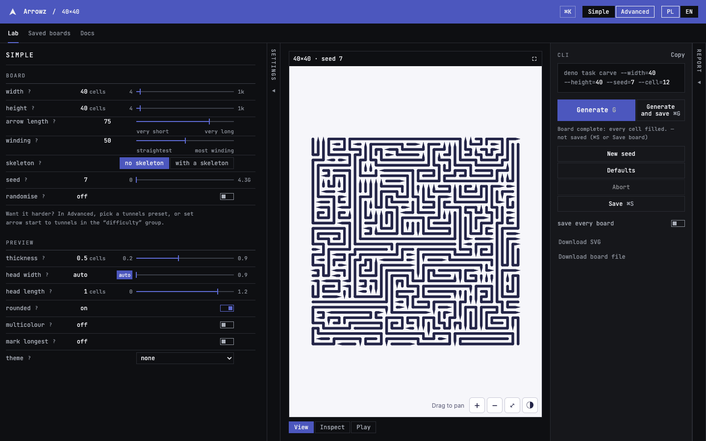
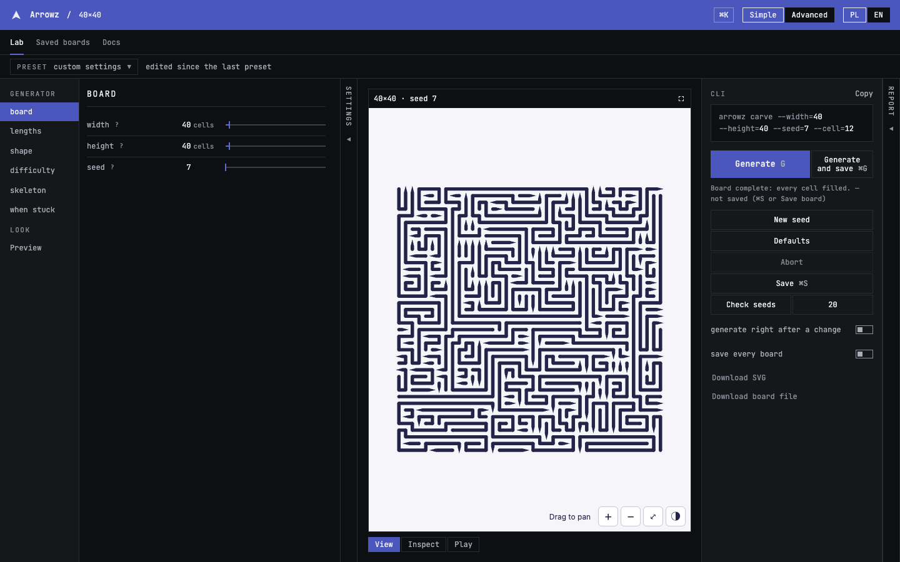
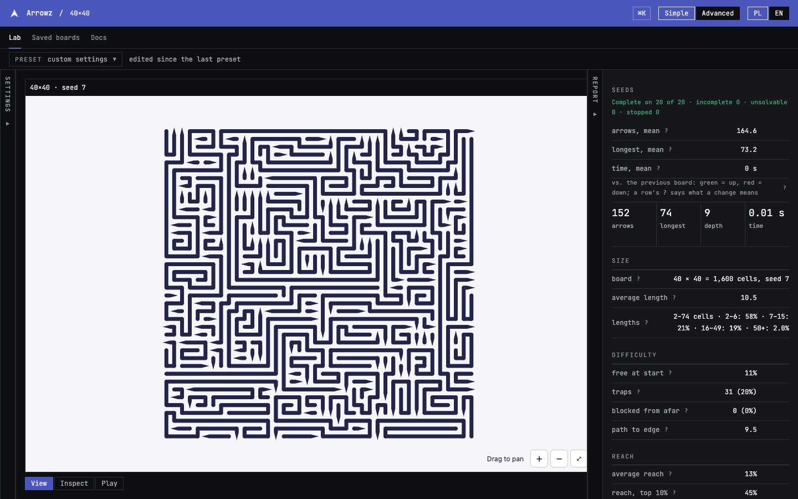
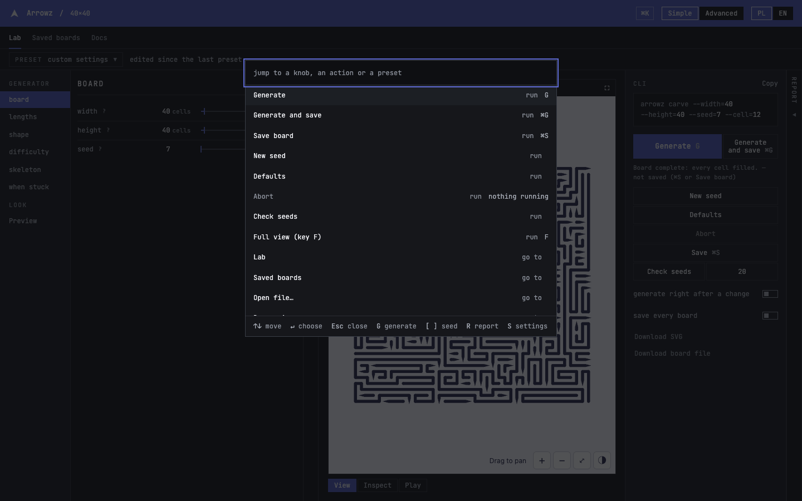
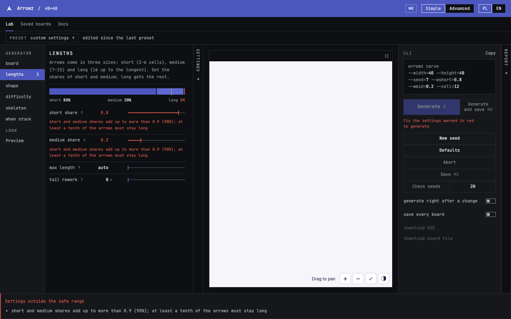
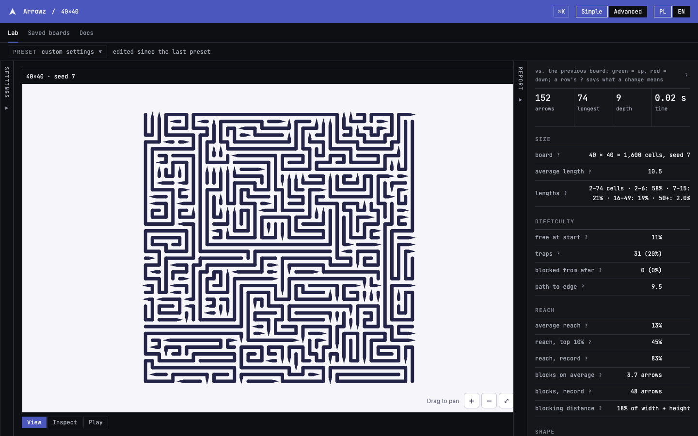
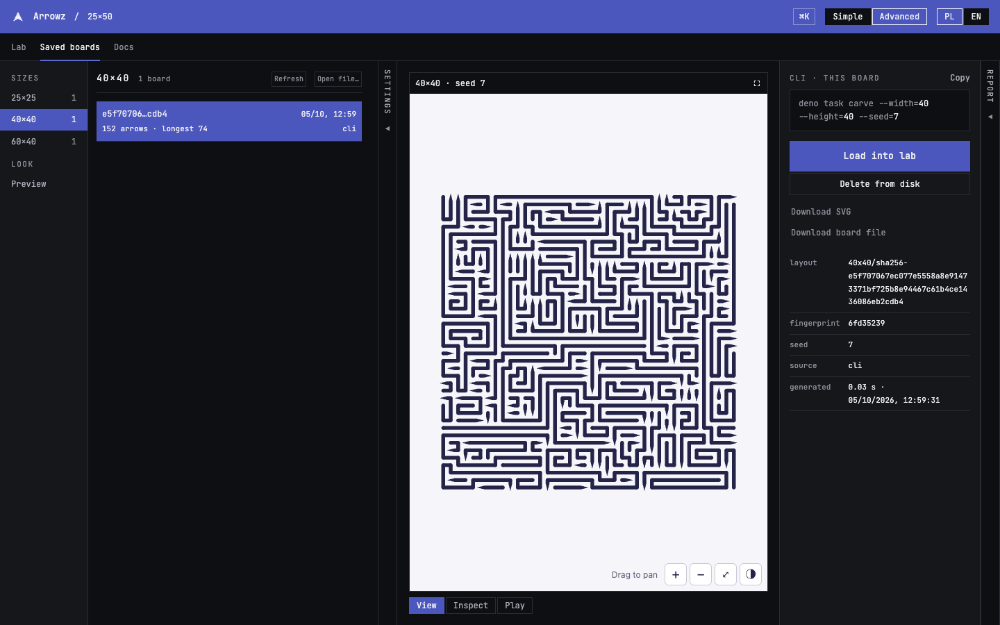
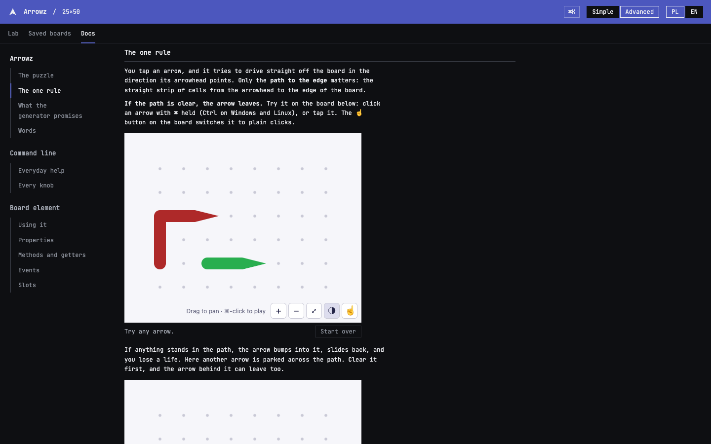
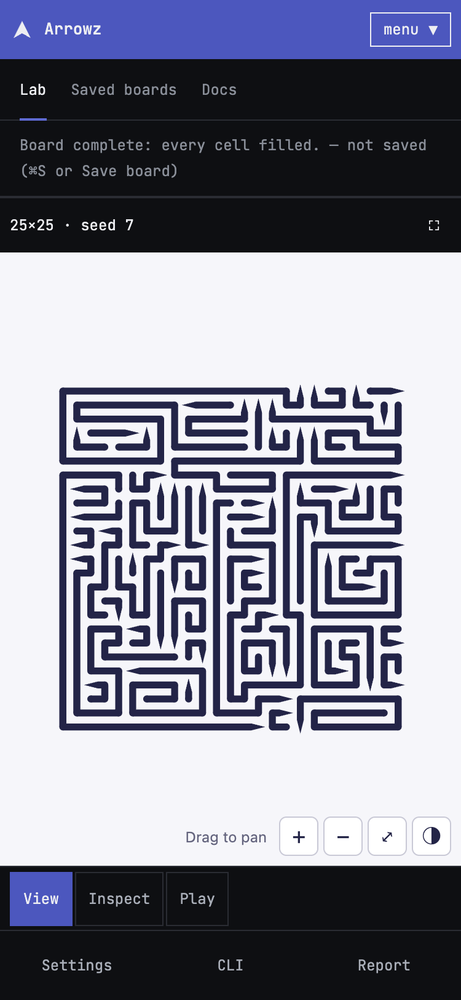
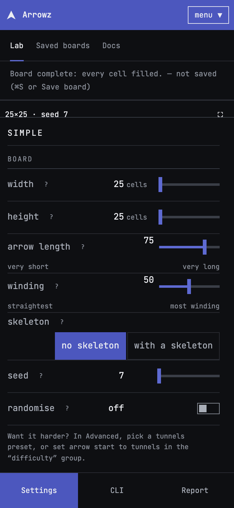

# Arrowz lab

A small application for playing with the generator's settings and seeing the
result at once: the board, its measurements, the command line that reproduces
it, and a library of saved boards. It is a React application served by Vite,
draws the board with [`<arrowz-board>`](../../packages/board-element/README.md)
and runs the [engine](../../packages/engine/README.md) in a worker. The
interface is in English and Polish.



This README describes the lab as the code defines it: `src/readme.test.ts`
compares its routes, keys, palette commands, link fields, ports, Nx targets and
screenshots with the code both ways.

## Contents

- [Starting it](#starting-it)
- [The screens](#the-screens)
- [Using the lab](#using-the-lab)
- [Keys](#keys)
- [The command palette](#the-command-palette)
- [Links](#links)
- [Screenshots](#screenshots)
- [Development](#development)

## Starting it

The lab draws the board with the board element, which needs Lit: run
`corepack enable pnpm && pnpm install` once at the top of the repository before
the first start. The lab keeps its boards in the store, which is served by a
small Deno program, so one command starts both:

```sh
pnpm nx serve lab      # the lab (8779) and, alongside it, the board store (8777)
```

Open `http://localhost:8779`. Stop it with Ctrl+C, which stops the store too.
The store keeps its boards in `packages/cli/boards/`, the directory the CLI
writes; `ARROWZ_BOARDS_DIR=<directory> pnpm nx serve lab` points both at
another one. To run the store on its own — the CLI writes boards directly and
never needs it — use `deno task store`.

The lab expects the store on 8777; if that port is taken on your computer, both
sides have to be told the new number — the store takes it after the command
(`deno task store 9000`), and the lab reads it from `LAB_SERVER` in
`vite.proxy.ts`. A second `pnpm nx serve lab` does not start a second store: Nx
notices the continuous target is already running and waits on it, while Vite
moves the second lab to the next free port (8780).

The lab is served, not opened: a blank page means `pnpm nx serve lab` is not
running. A lab served some other way (a static host, say) still runs without
the store; if the saved boards are empty or a save is refused, the store is
missing — start `deno task store` beside it.

## The screens

Three tabs: **Lab**, **Saved boards** and **Docs**. Every screen has an address,
so a browser's back button and a bookmark work.

| Route               | Shows                                                                                                                                           |
| ------------------- | ----------------------------------------------------------------------------------------------------------------------------------------------- |
| `/`                 | The lab: the settings, the board and what the run reported.                                                                                     |
| `/boards`           | The saved boards, by size; it opens on the board shown last.                                                                                    |
| `/boards/:size/:id` | One stored board, by its size and its layout hash.                                                                                              |
| `/boards/file`      | A board opened from a file on disk.                                                                                                             |
| `/docs`             | Goes to `/docs/arrowz`.                                                                                                                         |
| `/docs/:what`       | The documentation: `arrowz` for the puzzle and its rule, `lab` for the lab itself, `cli` for the command line, `element` for the board element. |
| `*`                 | Any other address goes to `/`.                                                                                                                  |

## Using the lab

### Simple and advanced

**Simple** is the default: board size, two sliders (arrow length, winding), a
skeleton switch and the seed — the same choices as the plain command line,
with the preview settings (line thickness, head size, colours, theme) below.
**Advanced** shows every knob of the generator, grouped and each with its help,
and a preset list from Easy 25×25 up to Insane 1000×1000. The switch is in the
top bar, beside the language.



Either way the lab shows the exact command that reproduces what you are looking
at, ready to copy, and it keeps that command on screen when the settings are
refused, so rejected settings can still be copied.

### When a setting breaks a rule

A knob outside its range, or a combination the measurements showed to jam,
turns its rows red with the reason beside them, marks its group in the list,
and lists every broken rule at the bottom of the screen. Generating is refused
until it is fixed.

### Generating and saving

**Generate** (`G`) carves a board from the settings on screen; **New seed** draws a random seed and generates, while `[` and `]` step the seed back or forward by one; **Defaults** puts every knob back; **Abort** stops
a run and keeps the board carved so far. A board is not stored until you
**Save** it (`⌘S`), or use **Generate and save** (`⌘G`); the switch _save every
board_ saves each finished run. In the advanced view, _generate right after a
change_ starts a run whenever a knob moves, and **Check seeds** runs the current
settings over a number of seeds and reports how many boards came out complete.
**Download SVG** and **Download board file** export the board on screen.



### The report

The report drawer on the right (`R`) lists the run's measurements — arrows,
lengths, how hard the board plays, how far arrows reach, their shape — each with
a `?` that explains it, and colours each change against the previous board.
The settings drawer on the left opens and closes with `S`; `F` hides both and
gives the board the whole window.

### Saved boards and files

**Saved boards** lists the store by size. A stored board shows its command,
seed and timing; **Load into lab** brings its settings back, **Delete from
disk** removes it. **Open file…** opens a `.board.json` from disk (with its
meta file, when you choose both), which the lab shows without storing it.

### The board

Under the board, **View** is for looking: drag to pan, zoom with the buttons or
the wheel. **Inspect** describes the arrow you choose. **Play** plays the
board: a free arrow leaves, a blocked one bounces.

## Keys

The single keys work on the Lab and Saved boards tabs, but not while you type
into a field; the run keys bring the lab first when pressed on Saved boards.
On Windows and Linux `⌘` is Ctrl.

| Key   | Does                                                                 |
| ----- | -------------------------------------------------------------------- |
| `G`   | Generate.                                                            |
| `[`   | The previous seed.                                                   |
| `]`   | The next seed.                                                       |
| `R`   | Opens or closes the report.                                          |
| `S`   | Opens or closes the settings.                                        |
| `F`   | Full view: the board alone.                                          |
| `Esc` | Closes one layer: an open sheet, then the report, then the settings. |
| `⌘G`  | Generate and save.                                                   |
| `⌘S`  | Save the board on screen.                                            |
| `⌘K`  | Opens the command palette, on every screen, also from a field.       |

## The command palette

`⌘K` opens a search over everything the lab can do. Its rows come in sections:
_run_ and _go to_, below, then a row for every knob, every preview setting
and every preset, so typing a knob's name or its CLI flag (`--seed`) jumps to
it. A row that cannot run now stays listed, with the reason where its key
would be.



| Command                | Section | Does                                                                  |
| ---------------------- | ------- | --------------------------------------------------------------------- |
| `Generate`             | run     | Generates a board from the settings.                                  |
| `Generate and save`    | run     | Generates a board and stores it.                                      |
| `Save board`           | run     | Stores the board on screen.                                           |
| `New seed`             | run     | Draws a random seed and generates.                                    |
| `Defaults`             | run     | Puts every knob back to its default.                                  |
| `Abort`                | run     | Stops the run; while one is stopping, _Discard_ drops its board.      |
| `Check seeds`          | run     | Runs the settings over a number of seeds (advanced view only).        |
| `Full view (key F)`    | run     | The board alone.                                                      |
| `Lab`                  | go to   | The lab.                                                              |
| `Saved boards`         | go to   | The saved boards.                                                     |
| `Open file…`           | go to   | Opens a board file from disk.                                         |
| `Docs — Arrowz`        | go to   | The puzzle, its one rule played on three small boards, and its words. |
| `Docs — Lab`           | go to   | How the lab works: its views, keys, palette and links.                |
| `Docs — Command line`  | go to   | The command line's documentation.                                     |
| `Docs — Board element` | go to   | The board element's documentation.                                    |
| `Simple view`          | go to   | Switches the view; in the simple view the row reads _Advanced view_.  |
| `Switch to Polish`     | go to   | Switches the language; in Polish the row offers English.              |

## Links

The address of the lab carries the settings, so a link opens the same board
and generates it. After the `#` comes JSON, percent-encoded: every knob by its
engine key at the top level (`W`, `H`, `seed`, `wShort`…), and the preview
under `__view`:

```text
http://localhost:8779/#{"W":40,"H":40,"seed":7,"__view":{"colored":true,"lang":"pl"}}
```

A field left out takes its default, and a value the lab cannot read is ignored.

| Field              | Means                                           |
| ------------------ | ----------------------------------------------- |
| `cell`             | The cell size of an exported SVG, in pixels.    |
| `stroke`           | The line thickness, in cells.                   |
| `headWidth`        | The arrowhead's width in cells; 0 is automatic. |
| `headHeight`       | The arrowhead's length, in cells.               |
| `rounded`          | Rounded turns and a disc tail.                  |
| `colored`          | One colour per arrow.                           |
| `highlightLongest` | Marks the longest arrows.                       |
| `top`              | How many longest arrows are marked.             |
| `voids`            | Shows the cells the generator left empty.       |
| `showPoints`       | The point grid.                                 |
| `pointColor`       | The colour of its dots.                         |
| `pointRadius`      | The radius of its dots, in cells.               |
| `pad`              | The margin around the board, in cells.          |
| `theme`            | A built-in theme by name.                       |
| `paper`            | The background colour.                          |
| `ink`              | The colour of the arrows.                       |
| `highlightColor`   | The colour of the marked arrows.                |
| `palette`          | The arrow colours while `colored` is on.        |
| `lang`             | The page's language, `en` or `pl`.              |

## Screenshots

The lab in English at 1440×900 and on a phone at 375×812. `docs/screenshots.json`
records how each was taken, and `pnpm nx run lab:screenshots` takes them again.











<p>
  
  
</p>

## Development

| Target        | Runs                                                                                                                                         |
| ------------- | -------------------------------------------------------------------------------------------------------------------------------------------- |
| `serve`       | The lab on 8779, with the store it needs.                                                                                                    |
| `check`       | `tsc` over the sources.                                                                                                                      |
| `lint`        | ESLint.                                                                                                                                      |
| `fmt`         | Prettier, this README included.                                                                                                              |
| `test`        | Vitest: the `node` and `node-integration` projects, and the `chromium` project in a real browser.                                            |
| `build`       | `vite build` into `dist/`.                                                                                                                   |
| `smoke`       | `scripts/worker-smoke.mjs`: the built worker must carve the engine's board.                                                                  |
| `verify`      | `check`, `lint`, `fmt`, `test`, `build` and `smoke`.                                                                                         |
| `screenshots` | `scripts/screenshots.mjs`: retakes the screenshots of this README, or only the shots named after it (`pnpm nx run lab:screenshots palette`). |

`screenshots` needs Deno (the store and the CLI) and Playwright's Chromium
(`pnpm exec playwright install chromium`). It runs the lab on free ports over a
store in a temporary directory, so it touches neither `packages/cli/boards/` nor
a lab already running. Each shot in `docs/screenshots.json` names its route, the
knobs in its link, the window size, what is in `localStorage` (`labLang`,
`labView`, `labReport`, `labSettings`), and the keys pressed or the buttons
clicked before the picture.
