# Arrowz command line

The command-line side of [Arrowz](../../README.md): `deno task carve` makes
boards, `deno task report` measures the generator, `deno task store` serves the
saved boards to the lab, and `deno task compile` builds `carve` as one program.
Every command below runs from the repository's root folder; how to get there,
and what the puzzle is, is in the [main README](../../README.md).

## Contents

1. [Making a standalone program](#making-a-standalone-program)
2. [The commands](#the-commands)
3. [The everyday settings](#the-everyday-settings)
4. [The full set of settings](#the-full-set-of-settings)
5. [Where boards are saved](#where-boards-are-saved)
6. [Environment variables](#environment-variables)
7. [When something goes wrong](#when-something-goes-wrong)
8. [Words](#words)

---

## Making a standalone program

If you would rather have a single file you can run without Deno being involved
every time:

```sh
deno task compile
```

That writes a self-contained program to `packages/cli/dist/carve`. It takes
exactly the same options as the `carve` task, and is shorter to type:

```sh
./packages/cli/dist/carve --width=25 --height=25 --dry-run
```

One catch. The standalone program does not know where the repository is, so it
cannot work out where to file boards. Before asking it to save anything, tell
it where to put them:

```sh
export ARROWZ_BOARDS_DIR=~/arrowz-boards
./packages/cli/dist/carve --width=25 --height=25
```

Without that, saving fails with an error about a directory it cannot create.
Asking it to describe a board rather than save one (`--dry-run`, below) works
either way.

---

## The commands

Everything runs through the `carve` task, one dialect: the everyday flags and
the engine's own knobs stand side by side on the same command line. There is
no switch that changes what a flag means.

It prints its own instructions:

```sh
deno task carve --help          # the short form: everyday flags, output, picture (-h too)
deno task carve --help=knobs    # the full table: every knob, its range and default
```

### Making a board

```sh
deno task carve --width=40 --height=40 --seed=7
```

Writes two files into `packages/cli/boards/40x40/`:

* `sha256-e5f707067ec077e5558a8e91473371bf725b8e94467c61b4ce1436086eb2cdb4.board.json` — the board: every arrow, cell by cell, packed
  small. This is the file a game loads.
* `sha256-e5f707067ec077e5558a8e91473371bf725b8e94467c61b4ce1436086eb2cdb4.json` — a small text file recording how it was made.

The name is worked out from the arrows on the board, not from the settings.
Another seed or other settings that happen to lay the very same arrows land in
the same files, and the small file lists every command that made them — so
"has this board been made before?" is "is its file there?".

### Getting a picture as well

```sh
deno task carve --width=40 --height=40 --svg
deno task carve --width=40 --height=40 --svg=my-board.svg
```

`--svg` adds `sha256-e5f707067ec077e5558a8e91473371bf725b8e94467c61b4ce1436086eb2cdb4.svg` next to the board. `--svg=my-board.svg` does
the same and also drops a copy at `my-board.svg`.

### Five things to try

Copy any of these. Each one writes a board into `packages/cli/boards/`; add
`--svg` to get a picture of it as well, or `--dry-run` to see the numbers
without writing a file. Every flag used here is explained in
[The everyday settings](#the-everyday-settings).

```sh
# small enough to follow every arrow by eye
deno task carve --width=12 --height=12 --colored

# a dense field of tiny arrows
deno task carve --width=40 --height=40 --length=0 --colored

# a few long snakes instead
deno task carve --width=40 --height=40 --length=1 --winding=0 --colored

# a skeleton of very long arrows crossing the whole board
deno task carve --width=80 --height=80 --skeleton --colored

# a tall board, which is harder to play than a square one
deno task carve --width=40 --height=80
```

### Making many boards at once

```sh
deno task carve --width=100 --height=200 --seed=1 --count=50
```

Makes 50 different boards on the seeds 1, 2, 3 and so on. A seed whose board
is not complete is skipped (and not saved), and so is a seed that lays a board
already in the store — its command is added to that board's file — and the next
seed is tried, until there are 50. After twice as many seeds as boards it gives
up; `--max-seeds=200` moves that limit. The last line says how many boards were
written and which seeds were skipped, and why. The same command always makes the
same boards.

### Describing a board without saving it

```sh
deno task carve --width=30 --height=30 --seed=7 --dry-run
```

Builds the board, writes nothing, and prints one line of text describing it, in
a format meant for programs rather than people. Trimmed to the interesting
parts:

```json
{
  "W": 30, "H": 30, "seed": 7,
  "ok": true,
  "pieces": 87,
  "avgLen": 10.34,
  "maxLen": 44,
  "solvable": true,
  "genMs": 11,
  "pinned": [],
  "command": "deno task carve --width=30 --height=30 --seed=7"
}
```

Read that as: the board was built successfully, it holds 87 arrows, the average
arrow is 10.3 cells long, the longest is 44, the puzzle has a solution, and the
whole thing took 11 milliseconds. `command` is the command that reproduces it.
`pinned` lists any knob you named yourself on the command line — empty here,
because this run used only everyday flags; see ["When a knob meets an everyday
flag"](#when-a-knob-meets-an-everyday-flag) below.

This is the fastest way to try a setting: you see how many arrows you get and
how long it took, without a single file on disk.

### When a board is not complete

Rarely, at large sizes, the generator gives up before every cell is covered.
The board is still saved, the description says `"ok": false`, and the command
exits with code 1 so that scripts notice. Add `--svg` and the picture shows
the uncovered cells tinted pink. A run that is taking too long can be cut
short:

```sh
CARVE_TIMEOUT_S=60 deno task carve --width=1000 --height=1000
```

That stops after a minute and saves whatever was drawn by then, marked
`"aborted": true`.

### Printing the measurements report

```sh
deno task report --only=easy --square --runs=1
```

A separate command, `deno task report`, builds boards at a chosen size and
prints a page of measurements about them. This one is a diagnostic tool for
people tuning the generator, not something you need to read. Real output:

```
--- Easy 25x25 (1 runs) ---
  coverage      100.00%   solvable: YES
  pieces        72   length 2..42
  length dist.  2-6: 63%  7-15: 22%  16-49: 15%  50+: 0.0%
  ...
  time          generation 22 ms, metrics 2 ms
```

The two lines worth knowing: `coverage 100.00%` means no cell was left
uncovered, and `solvable: YES` means the puzzle can be finished.

With no `--only` it walks through every difficulty level in turn, up to
1000×1000, which takes a long time. It takes the knobs `carve` takes, and these
flags of its own:

| Flag | What it does |
|---|---|
| `--only=NAME` | one level only, by its name as the report prints it (`easy·sq`, `hard·pt`, …) |
| `--square` | square boards only; `easy` then names the square one |
| `--portrait` | portrait boards (twice as tall as wide) only |
| `--mid=N` | adds an N×N level between the fixed ones, for finding where boards stop closing |
| `--runs=N` | boards per level, 3 by default |
| `--show` | prints, as text, the first board of each level at most 40 cells wide |
| `--bench=N` | measures speed instead: N runs per level, with timing statistics |

### Asking for something impossible

The generator refuses settings it knows will not work before it starts, not
after ten minutes of grinding:

```sh
deno task carve --width=30 --height=30 --pstraight=0.2 --svg=/tmp/x.svg
```

```
invalid arguments:
  - --pstraight=0.2 is outside 0.6..1
see --help
```

The command ends with status code 2. A status code is a number a program leaves
behind when it finishes, and scripts read it to learn how things went: 0 means
everything went fine, 1 means the generator gave up, and 2 means you asked for
something out of range.

---

## The everyday settings

Twelve flags in four groups: two for size, one for luck, four that change the
puzzle, and five that change only how the picture is drawn.

### Size — `--width` and `--height`

How many cells across and down. Both are required. Anything from 4 to 1000.

A 400×400 board is ready in under two seconds; 1000×1000 takes about ten. A
tall board is harder to play than a square one with the same number of cells,
because arrows have further to travel.

| `--width=20 --height=40` | `--width=100 --height=100` |
|---|---|
| 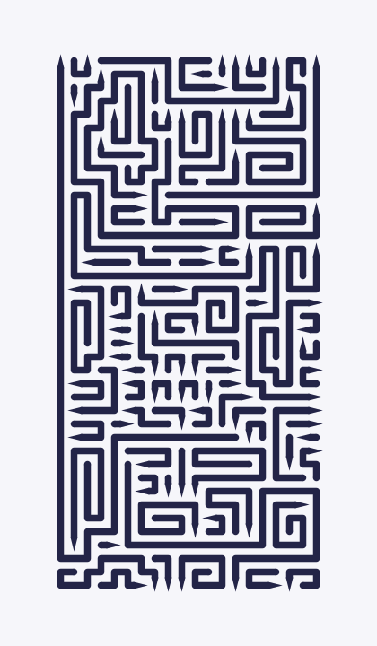 | 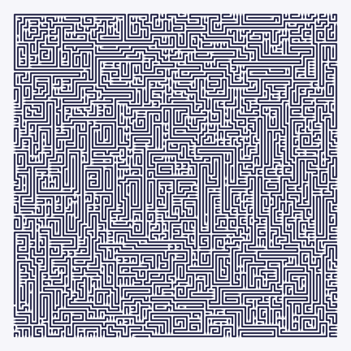 |

### How big a board can get

The ceiling is 1000×1000 — a million cells. Past roughly two hundred cells a
side the arrows stop being individually visible on screen, and the board
turns into fabric. All three below are shown at the same width here; only the
real size differs.

| 200×200 | 500×500 | 1000×1000 |
|---|---|---|
| 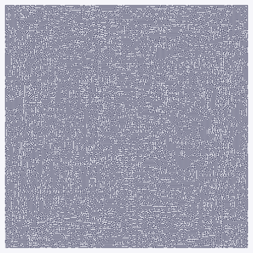 | 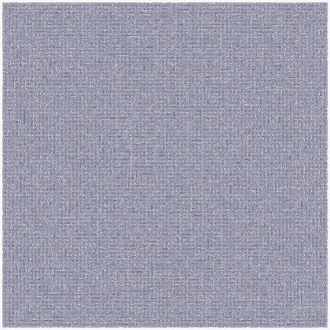 | 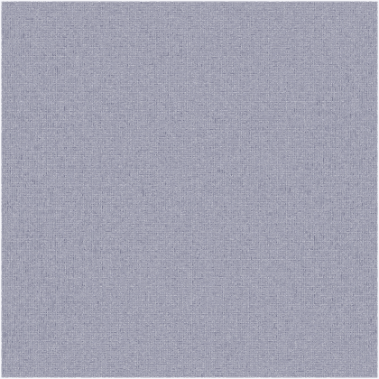 |
| **3,619 arrows**, 0.2 s | **21,771 arrows**, 1.4 s | **85,809 arrows**, 9.6 s |

Nothing about the puzzle changes at that size. Here is a thirty-by-thirty
window into the million-cell board, drawn at the same zoom as the 30×30
boards in the comparisons below — the same picture, just one part of a much
bigger one:

<p align="center">
  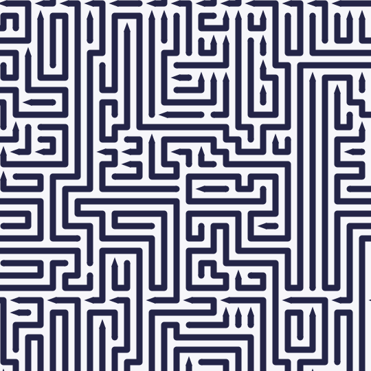
</p>

Two things are worth noticing in the numbers. The average arrow barely grows
with the board — 11.1 cells at 200×200 against 11.7 at 1000×1000 — so a bigger
board buys you more arrows rather than longer ones. The single longest arrow
does grow: 213 cells, then 278, then 354.

Unlike the smaller examples, these three are not stored here as drawings you
can download. Their files run to 0.9 MB, 7 MB and 22 MB, which is more than
belongs in a repository. Make your own with one command:

```sh
deno task carve --width=1000 --height=1000 --seed=7 --svg=huge.svg
```

### Seed — `--seed`

<!-- seed-range -->
A number from 0 to 4294967295 that picks which board you get. With everything
else unchanged, the same seed always gives the same board. A different seed
gives a different board of the same character. Default: 7.

| `--seed=7` | `--seed=42` |
|---|---|
| 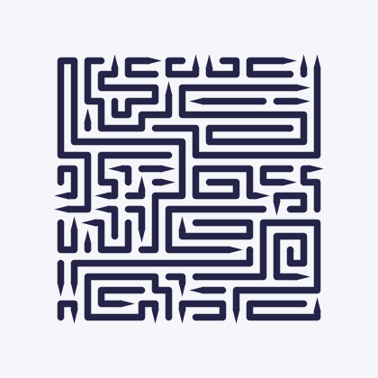 | 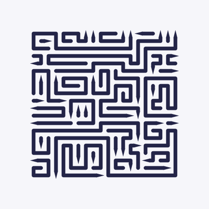 |

### Arrow length — `--length`

An option from 0 to 1. Default: `0.75`.

Turn it **down** and the board fills with short arrows: many of them, each with
its own arrowhead, packed together like a field of little hooks. Turn it **up**
and the board is made of a few long snakes with arrowheads few and far between.

Measured on a 30×30 board with seed 7:

| `--length=0` | default (`0.75`) | `--length=1` |
|---|---|---|
| 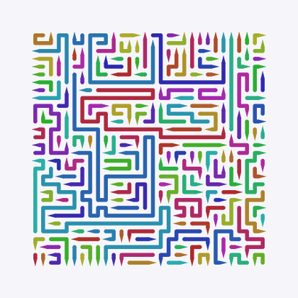 | 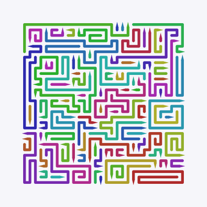 | 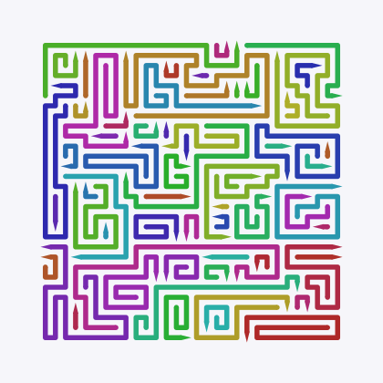 |
| **176 arrows**, average 5.1 cells | **87 arrows**, average 10.3 cells | **65 arrows**, average 13.9 cells |

More arrows is not automatically harder — it is a different kind of hard. Short
arrows give you many things to look at; long arrows give you fewer but each one
reaches further and blocks more.

### Winding — `--winding`

An option from 0 to 1. Default: `0.5`. It controls how eagerly an arrow keeps
going straight instead of turning: `0` is the straightest a board gets, `1` is
the most winding.

Turn it **down** and arrows run in long straight strokes. Turn it **up** and
they wriggle, turning every few cells and worming into small nooks.

| `--winding=0` (straightest) | default (`0.5`) | `--winding=1` (most winding) |
|---|---|---|
|  |  | 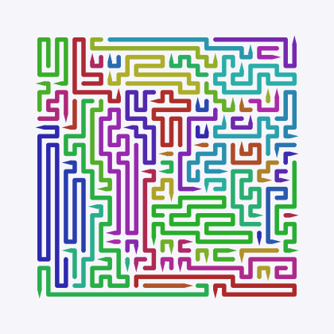 |
| 49 arrows, 2.1 turns each | 87 arrows, 3.2 turns each | 66 arrows, 5.5 turns each |

Worth noticing: pushing this option to either extreme gives you *fewer* arrows
than the middle. Straight arrows run further before they stop; winding arrows
swallow more cells each while filling in corners. The busiest boards are
the ones in between.

### Skeleton — `--skeleton`

An on/off switch, off by default. Switch it on and the generator first lays a
handful of very long arrows, the skeleton, snaking back and forth across the
whole board. Then it fills the channels between them with ordinary arrows.

| without | `--skeleton` |
|---|---|
| 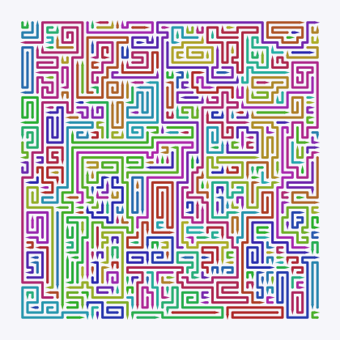 | 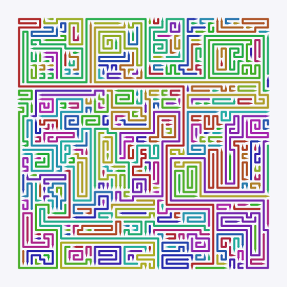 |
| 337 arrows, longest 103 cells | 291 arrows, longest **168** cells |

This is the only way to get genuinely long arrows. Left to itself the generator
rarely produces one that crosses the entire board.

### Fresh luck every time — `--randomized`

Normally an option's position means one exact recipe. With `--randomized`,
each option's position is treated as a *range*, and the generator draws a
fresh value from inside it on every run.

The practical effect: with this switch on, the same seed gives you a different
board every time. That extra roll of the dice is not controlled by the seed.

Nothing is lost. The settings that were actually drawn are written into the
board's text file as a full command, so any board you like can be reproduced
exactly.

```sh
deno task carve --width=40 --height=40 --randomized
```

Naming one of the internal knobs (below) alongside `--randomized` pins that one
knob and leaves the rest still being drawn — see
["When a knob meets an everyday flag"](#when-a-knob-meets-an-everyday-flag).

### How the picture is drawn

These sixteen change nothing about the puzzle — only how it looks on screen.

**`--colored`** gives every arrow its own colour. Useless for playing,
excellent for understanding. Every comparison picture on this page uses it.

| normal | `--colored` |
|---|---|
|  |  |

**`--line`** is how thick the lines are, as a fraction of one cell. Default
`0.5`, meaning a line fills half its cell.

| `--line=0.2` | `--line=0.9` |
|---|---|
| 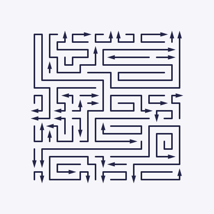 | 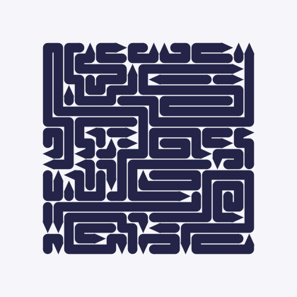 |

Note what happens to the arrowheads. On a thin line the arrowhead is a proper
triangle, wider than the line. Once the line gets thick, there is no room for a
wider triangle, so the arrowhead becomes a sharpened point instead.

**`--arrow-width`** and **`--arrow-height`** size the arrowheads by hand,
measured in cells. They behave differently. `--arrow-width` defaults to `auto`,
meaning "work it out from the line thickness"; a number instead is a width in
cells. `--arrow-height` has no such automatic mode — it is always taken
literally, and it defaults to `1`, one whole cell. Ask for `--arrow-height=0`
and you get an arrowhead of no height at all.

| `--arrow-width=0.6 --arrow-height=0.6` | `--arrow-width=0.9 --arrow-height=1.2` |
|---|---|
| 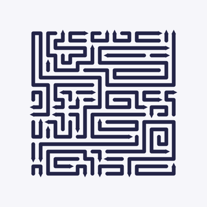 | 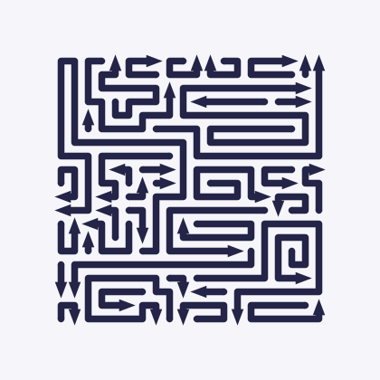 |

**`--sharp`** takes the rounding off. Normally a line turns a corner in a
curve and its blunt end is a rounded cap; with `--sharp` the corners are
angular and the blunt end is a square.

**`--theme`** paints the board in one of the lab's twelve colour themes
(`--theme=gruvbox-dark`, `--theme=catppuccin-latte`, …); an unknown name is
refused with the list. **`--paper`**, **`--ink`** and **`--highlight-color`**
set one colour each as `#rrggbb` and win over the theme's; **`--palette`**
gives the arrow colours for `--colored`, up to eight, comma-separated.

**`--pad`** is the margin around the board, in cells, 0 to 16 (default 4, as
the lab draws it). **`--points`** puts a dot in the centre of every cell, the
lab's dot grid; **`--point-color`** and **`--point-radius`** (in cells, up to
0.5) change the dot.

**`--cell`** is the size of one cell in the picture, in pixels, 1 to 200; left
out, it is worked out so that the longer side comes to about 1600 px.
**`--top`** highlights the N longest arrows (up to 1000) in the
`--highlight-color` and prints their measurements under the summary.

The lab's live command carries all of these, so copying it reproduces the
picture the lab exports.

---

## The full set of settings

The twelve everyday flags are shortcuts. Behind each of them sit several
internal knobs, and you can reach any of them directly, on the same command
line as the everyday flags — there is no separate mode to switch into. Turning
`--length` down, for instance, really means "raise the share of short arrows
and lower the share of medium ones" — two knobs at once.

You do not need this section to use the tool. It is here because the question
"what does this knob actually do" deserves an answer. The everyday ones are
called options on this page; the internal ones behind them are called knobs.

```sh
deno task carve --width=40 --height=40 --seed=7 --pstraight=0.95 --svg
```

That is the whole of it: name a knob and it takes over from whichever everyday
flag would otherwise have set it. The next section says exactly what "takes
over" means when more than one knob shares an everyday flag.

### When a knob meets an everyday flag

An everyday flag is not a shortcut for one knob — it sets a whole *bundle* of
them:

| Everyday flag | Knobs it sets |
|---|---|
| `--length` | `wshort`, `wmid` |
| `--winding` | `pstraight`, `wlateral`, `warns`, `anticoil` |
| `--skeleton` | `giants`, `giantspan`, `giantstep`, `giantjitter`, `wgiant` |
| *(always, the difficulty baseline)* | half of `--start`, `probe`, `probelen` |

`--start` is its own small case of the same rule: it sets the difficulty-baseline
half above, plus the layers/tunnels mix that nothing else sets. Ten knobs sit in
no bundle at all, so naming one of those has never been ambiguous:

<!-- unbundled -->

`lmax`, `backbite`, `trapbias`, `giantstraight`, `giantanticoil`,
`giantspacing`, `headtries`, `absorblimit`, `maxback`, `restarts`.

**A knob written on the command line wins, and pins only itself.** Without
`--randomized`, an everyday flag picks one value per knob in its bundle; naming
a knob yourself replaces that one value and leaves the rest of the bundle
exactly as the everyday flag would have set it. With `--randomized`, the
everyday flags draw their bundles from the measured safe ranges on every run;
a knob you name is **pinned** instead of drawn, while the rest of its bundle
keeps being drawn around it, seed after seed.

The CLI tells you when this happens, once per run, on stderr, and adds the
same fact to the `--dry-run` JSON so a script can see it without parsing
stderr:

```sh
deno task carve --width=30 --height=30 --randomized --pstraight=0.9 --dry-run
```

```
note: --pstraight=0.9 is pinned; --winding still sets wLateral, anticoil, warns
```

```json
{ "...": "...", "pinned": ["pStraight"], "...": "..." }
```

A pin can also name a knob that changes nothing under the rest of your
settings: a skeleton knob without a skeleton, the target length with the target
share at 0. The lab dims such a row; the CLI says it on a line of its own, in
the same words.

```sh
deno task carve --width=30 --height=30 --probelen=30 --dry-run
```

```
note: --probelen=30 is pinned; the difficulty baseline still sets headBias, probe
note: --probelen=30 has no effect here: needs target share > 0
```

That second line is left off a `--count` batch drawn with `--randomized`:
there every board gets its own knobs, drawn afresh rather than from the seed,
so one note printed for the whole run could not speak for all of them.

And when the draw has to **move** a value of its own to keep a rule, it says
which one and where it went. Naming a share bigger than what is left under the
cap makes the everyday flag's share give way:

```sh
deno task carve --width=30 --height=30 --length=0 --wmid=0.5 --dry-run
```

```
note: --wmid=0.5 is pinned; --length still sets wShort
note: --wshort moved from 0.75 to 0.4: short and medium shares together must stay at or below 0.9
```

The first line used to be the whole story, and the 0.4 in the board was a
number nothing on the screen accounted for.

What you give up by pinning: the safe ranges in the table below were measured as
whole bundles, so a half-pinned bundle still stays inside the envelope, but it
is no longer covered by the promise that *every* everyday combination fills its
board. The envelope still has the last word — a pinned value outside its own
range, or a combination that breaks a rule, is refused exactly as it would be
otherwise.

### The knobs

All 27, grouped the way `deno task carve --help=knobs` groups them. Ranges
spell their word forms where one exists; `auto`, `random` and `off` are
explained where they appear. **Step** is the distance between the settings a
knob has: a value that lands between two of them is refused, the same as one
outside the range, because it is a value neither the slider in the lab nor the
printed command could reach again.

This table is not copied by hand — `readme.test.ts` compares its flag, range,
step and default against the ones the CLI prints, in both languages, so a
knob that moves has to move here too.

<!-- knob-table -->

| Group | Flag | Range | Step | Default | What it does |
|---|---|---|---|---|---|
| Board | `--width` | 4–1000 | 1 | `25` | Columns. Under two seconds up to 400×400; about ten seconds at 1000×1000. |
| Board | `--height` | 4–1000 | 1 | `50` | Rows. A tall board is harder to play than a square one with the same number of cells. |
| Board | `--seed` | 0–4294967295 | 1 | `7` | Picks the board. Same seed and same knobs, same board. |
| Lengths | `--wshort` | 0–0.9 | 0.01 | `0.2` | Share of short arrows (2–6 cells). Higher means more arrows and more arrowheads, but the board turns into a mess of little hooks. Short plus medium together may not exceed 0.9. |
| Lengths | `--wmid` | 0–0.9 | 0.01 | `0.08` | Share of medium arrows (7–15 cells). Whatever is left over goes to long arrows. Short plus medium together may not exceed 0.9. |
| Lengths | `--lmax` | `auto`\|17–5000 | 1 | `auto` | The longest arrow the generator will attempt. `auto` means "two and a half times the longer side". **Careful:** below 17 the cap swallows both the medium and the long sizes, so the share between them stops changing the board. Use `auto`, or 17 and up. |
| Lengths | `--backbite` | 0–8 | 1 | `0` | How many times in a row an arrow that got stuck may rework its own tail instead of stopping there. The arrowhead, its cells and the path to the edge in front of it all stay as they were: only the body behind the arrowhead is re-routed, which hands the arrow a new tail to grow from. 0 is off, and gives the same board cell for cell. At 8 the arrows come out about a third longer on average and about a quarter fewer of them; most of that is already there at 2, and the board takes no measurably longer to generate. |
| Shape | `--pstraight` | 0.6–1 | 0.01 | `0.85` | How eagerly an arrow keeps going straight. Higher gives longer straight runs. **Careful:** the floor rises with the number of cells, not with the longer side. 0.6 fills 500×500, 600×600 needs 0.65, 800×800 needs 0.7 and 1000×1000 needs 0.8; a long thin board counts as its equivalent square, so 250×1000 asks no more than 500×500 does. A low `--warns` or a high `--anticoil` raises the floor further still. |
| Shape | `--wlateral` | 0–20 | 0.5 | `3` | How much an arrow prefers turning sideways over pushing deeper into open space. 0 gives long straight pushes and, occasionally, enormous spirals. |
| Shape | `--warns` | 2–16 | 1 | `4` | How eagerly an arrow fills small nooks before they become dead ends. Higher gives fewer, longer, more curled-up arrows. **Careful:** 2 and 3 raise the straightness a large board needs; at 6 and up they lower it. |
| Shape | `--anticoil` | 1–10 | 1 | `6` | How hard an arrow tries not to touch itself. 1 turns it off; higher gives fewer coils and slightly shorter arrows. **Careful:** 7 and up raise the straightness a large board needs; 4 and below lower it. |
| Difficulty | `--start` | `layers`\|`random`\|`tunnels`\|0.3–0.7 | - | `random` | Where the next arrow starts: the shallowest spot (`layers`, easy: many arrows free at once), anywhere (`random`), or the deepest (`tunnels`, hard: few arrows free at once). A number in 0.3–0.7 mixes the two instead — the fraction of arrows that start as tunnels. |
| Difficulty | `--trapbias` | `avoid`\|`off`\|`seek` | 1 | `off` | How a start whose path to the edge already holds exactly one arrow is ranked. Such an arrow, a trap, ends up looking ready to leave while one other arrow still blocks it, which is the thing that makes a board hard to read. `seek` makes 25–60% more of them, `avoid` a third to an eighth as many. Anything but `off` roughly doubles the time a board takes to generate. |
| Difficulty | `--probe` | 0–1 | 0.01 | `0` | Share of arrows whose length is drawn around one target length instead of the usual three-way split. |
| Difficulty | `--probelen` | 4–200 | 1 | `12` | That target length, give or take half. 4 triples the number of arrows; 200 gives a few very long ones. Does nothing unless `--probe` is above 0. |
| Skeleton | `--giants` | 0–40 | 1 | `0` | How many very long arrows are laid first, as the skeleton. 0 means no skeleton; 4 is a good starting point. Asking for many more is harmless but pointless: after the first two or three, later skeleton arrows run out of room. |
| Skeleton | `--giantspan` | 1–200 | 1 | `30` | How long one skeleton arrow aims to be, counted in lengths of the board's longer side. It stops early if it runs out of room. |
| Skeleton | `--giantstep` | `random`\|1–40 | 1 | `14` | The run gap: cells between the back-and-forth runs of a skeleton arrow. Small gives regular stripes like ruled paper; large gives a few wide sweeps; `random` lets it wander freely instead of running back and forth. |
| Skeleton | `--giantjitter` | 0–1 | 0.05 | `0.6` | How often a skeleton run stops short instead of going all the way to the obstacle. 0 gives perfectly straight, regular edges. |
| Skeleton | `--wgiant` | 0–0.2 | 0.01 | `0` | The chance that an arrow laid later is also a skeleton arrow. Above 0.05 it needs a `--giantstraight` of at least 0.6 plus this value (see the rules below). **Careful:** at 0.2 boards get slow. |
| Skeleton | `--giantstraight` | 0.5–1 | 0.01 | `0.94` | How straight a skeleton arrow runs where it has free space. **Careful:** 0.5 is no preference at all; below it the knob would weigh a straight move down, which is not what its name says. |
| Skeleton | `--giantanticoil` | 1–20 | 1 | `6` | The coil penalty, for skeleton arrows only. Whichever is higher, this or the general `--anticoil`, wins. |
| Skeleton | `--giantspacing` | `off`\|2\|3 | 1 | `2` | How many cells a skeleton arrow keeps between its own parallel runs. `off` turns the rule off. The flag takes these three values and nothing else: a wider radius only cost time, so it is not offered. |
| When stuck | `--headtries` | 2–16 | 1 | `4` | How many starting spots to try before giving up on a direction. **Careful:** at 2 the search is shallow for hard settings. At 8 and above you usually get the same board as at 4. |
| When stuck | `--absorblimit` | 12–64 | 1 | `24` | An empty patch up to this many cells that no arrow fits into gets glued onto a neighbouring arrow. **Careful:** near the bottom of the range, leftovers pile up and boards get stuck far more often. |
| When stuck | `--maxback` | `auto`\|50–1000 | 50 | `auto` | How many placed arrows may be taken back in one attempt before starting over. `auto` means 200, which is enough; more rarely rescues anything — it just delays the bad news. |
| When stuck | `--restarts` | 0–5 | 1 | `3` | How many fresh attempts, each with a nudged seed, after a failure. 0 shows you the raw success rate of your settings. |

Five knobs from an earlier version of this tool — `hug`, `edgehug`,
`strandlimit`, `giantwarns` and `giantspacepenalty` — are gone. Each did
nothing at its default, so removing it changes no board; each now lives in the
engine as a fixed constant instead of a flag.

### What some of these look like

Four knobs side by side, all on a 30×30 board with seed 7. Three of them
change the picture; the fourth changes something you cannot see.

**`--warns` — filling awkward corners first**

| `--warns=2` | `--warns=16` |
|---|---|
| 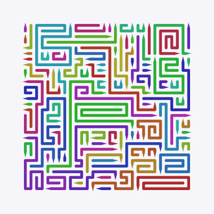 | 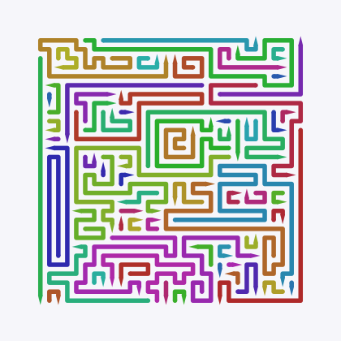 |
| 98 arrows, 2.4 turns each | 70 arrows, 3.8 turns each |

**`--wlateral` — turning sideways instead of pushing on**

| `--wlateral=0` | `--wlateral=20` |
|---|---|
| 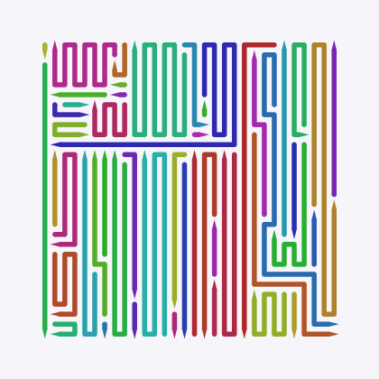 | 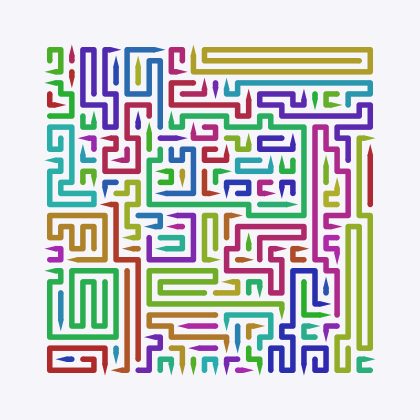 |
| 49 arrows, average 18.4 cells | 96 arrows, average 9.4 cells |

**`--probe` — one target length for every arrow**

| `--probe=1 --probelen=4` | `--probe=1 --probelen=200` |
|---|---|
| 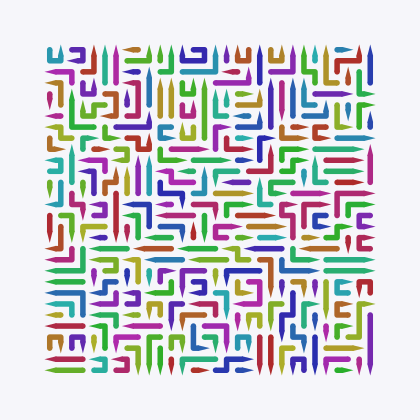 | 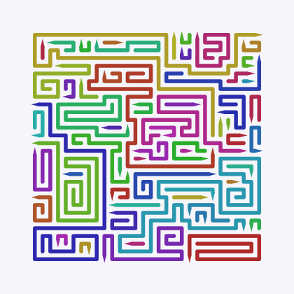 |
| 253 arrows, none longer than 4 cells | 61 arrows, longest 92 cells |

**`--start` — the knob you cannot see**

| `--start=layers` | `--start=tunnels` |
|---|---|
| 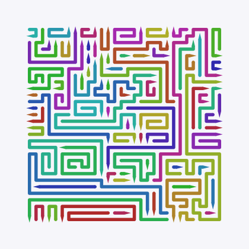 | 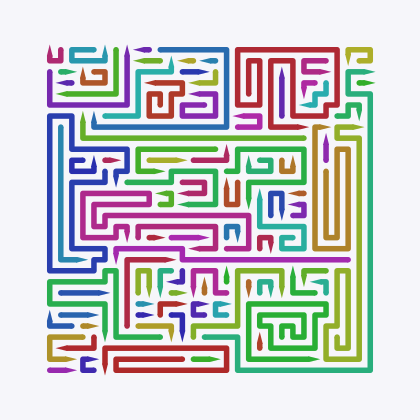 |
| 83 arrows, **34%** of them free to leave at the start | 90 arrows, only **6.7%** free at the start |

The last two pictures look much alike, and that is exactly the point. This
knob barely touches the drawing. What it changes is how many arrows are free
at any moment, and that is what makes a board easy or hard. At the default
(`--start=random`) the board sits between the two: 13% free. A number in
0.3–0.7 (`--start=0.3`…`--start=0.7`) mixes `layers` and `tunnels` instead of
choosing one: the number is the share of arrows that start as tunnels.

### Combinations that are refused

Five rules cannot be written as a simple from–to range, so they are checked
separately:

<!-- rule-table -->

| Flags | What is checked |
|---|---|
| `--wshort`, `--wmid` | Together they may not exceed 0.9, so at least a tenth of the arrows are long. |
| `--lmax` | `auto`, or 17 and up. |
| `--start` | A word (`layers`, `random`, `tunnels`) or a share in 0.3–0.7, and nothing else: a saved board whose arrow start and tunnel share are a pair no `--start` can write is refused, because its command would rebuild a different board. |
| `--pstraight`, `--warns`, `--anticoil` | The straightness a board needs rises with its longer side — 0.6 up to 500×500, 0.65 at 600×600, 0.7 at 800×800, 0.8 at 1000×1000 — and `--warns` below 4, or `--anticoil` above 6, raises it further; a high `--warns` or a low `--anticoil` lowers it. Below the floor the board does not fill, and the refusal names the number this board needs. |
| `--wgiant`, `--giantstraight` | Above a `--wgiant` of 0.05, `--giantstraight` must be at least 0.6 plus `--wgiant`: 0.7 at 0.1, 0.8 at 0.2. Skeletons added later that wander instead of running straight leave a 1000×1000 board that never fills; the refusal names the number needed. |

Break a rule, put any knob outside its range, or land between two of its
steps, and the generator refuses before drawing anything, tells you which
value was wrong, and stops with status code 2. It never quietly rounds your
number into range: `--maxback=75` is refused rather than nudged to 50 or 100,
because a value no slider and no printed command can reach would make the
board unreproducible.

The everyday options cannot break these rules. They were built so that every
value of every everyday option, at every board size, produces a valid
combination — as long as you leave every knob in its bundle to be set by the
everyday flag; see ["When a knob meets an everyday
flag"](#when-a-knob-meets-an-everyday-flag) above for what pinning one costs.

---

## Where boards are saved

By default, boards go into `packages/cli/boards/`, sorted into a folder per size:

```
packages/cli/boards/
  25x25/
    sha256-0dc74eeff4ad01590a81f3aa79727f673dad073976f7a37df4bd8a4af4d7b978.board.json   the board
    sha256-0dc74eeff4ad01590a81f3aa79727f673dad073976f7a37df4bd8a4af4d7b978.json         what it was made from
    sha256-0dc74eeff4ad01590a81f3aa79727f673dad073976f7a37df4bd8a4af4d7b978.svg          the picture, only with --svg
  40x40/
    ...
```

The file name is worked out from the arrows on the board. The same arrows from
another seed or other settings share one set of files, and the `.json` file
lists every command that made them. (Colours and line thickness are not part of
the name, so changing only those writes to the same file name and replaces the
picture.)

Point it somewhere else with the `ARROWZ_BOARDS_DIR` variable:

```sh
export ARROWZ_BOARDS_DIR=~/arrowz-boards
deno task carve --width=25 --height=25
```

The `.json` file next to each board holds every setting used, when it was
made, how long it took, and how many arrows it has. It also holds a `command`
line that makes the same board again, exactly. If you keep only one thing from
a board, keep that line.

> Boards are not part of the repository. `packages/cli/boards/` is deliberately
> left out of it: a 1000×1000 board file is about a megabyte, and its picture
> tens of megabytes.

---

## Environment variables

`carve` and `report` read four variables, and nothing else from the
environment:

| Variable | What it does |
|---|---|
| `ARROWZ_BOARDS_DIR` | where boards are saved instead of `packages/cli/boards/` (see [Where boards are saved](#where-boards-are-saved)) |
| `CARVE_TIMEOUT_S` | gives up a board after that many seconds; `carve` stores the part built so far as incomplete |
| `CARVE_TRACE` | set to `1`, prints the generator's progress on stderr as it works |
| `GIANT_DEBUG` | set to `1`, prints how each very long arrow (a giant) was grown, on stderr |

---

## When something goes wrong

**`deno task` says it could not find `deno.json`** — you are outside the project
folder.
`cd` into the `arrowz` folder and try again.

**`Requires env access`** — you ran `deno run packages/cli/carve.ts` directly.
Deno refuses to let a program touch your files or settings unless told to. Use
the `carve` task, which grants exactly what is needed.

**`unknown flag …`** — the CLI does not recognise that flag at all. Check the
spelling against `--help` or `--help=knobs`.

**`--straight is gone: use --winding=R …`** (or `--advanced`, `--board`,
`--w`/`--h`, `--colorized`, `--lineweight`, `--headwidth`/`--arrowwidth`,
`--headheight`/`--arrowheight`, `--lateral`, `--absorb`, `--headbias`,
`--mix`) — an old spelling from before this tool had one mode. The message
names its replacement; use that instead.

**`invalid arguments: --pstraight=0.2 is outside 0.6..1`** — a value is out of
range, between two of a knob's settings, or breaks one of the rules. Every line
starts with the flag to change, whether the parser caught it or the safe
envelope did, and a broken rule names every flag it is about. Nothing was
generated and nothing was written.

**`failed to close board …`** — the generator tried, backed up, restarted, and
still could not fill the board. Almost always a knob marked **Careful:** in
[the knobs](#the-knobs). Move it back towards its default, or try another seed.
The board is in `packages/cli/boards/` all the same; add `--svg` and the
picture shows the uncovered cells tinted pink, so you can see where it got
stuck.

**`failed to close board …: covered, but the rays make a cycle`** — every cell
is filled, and still no tap is ever legal: two arrows point at each other, or a
longer ring of them do. This is a bug in the generator, not a setting you chose
— nothing you can type produces it, because the generator gives each arrow its
path to the edge before anything stands in it. If you ever see the line, the
board is still written to `packages/cli/boards/`; please keep it and report it,
because it is the board that should not exist.

**One board takes forever** — set `CARVE_TIMEOUT_S` to a number of seconds and
the generator stops there, saving whatever it had drawn:

```sh
CARVE_TIMEOUT_S=60 deno task carve --width=1000 --height=1000
```

**The report takes forever** — `deno task report` with nothing else walks
every difficulty level up to 1000×1000, three times each. Add `--only=easy
--square --runs=1`. Note that `--only=easy` on its own matches nothing: it
needs `--square` or `--portrait` alongside it.

**Wondering what it is doing** — set `CARVE_TRACE=1` and it reports progress as
it goes:

```sh
CARVE_TRACE=1 deno task carve --width=200 --height=200
```

```
    [trace] pieces 7000, remaining 2516, backtracks 0, 252 ms
```

---

## Words

The words of the puzzle itself (arrow, arrowhead, path to edge, free, seed) are
in the [main README](../../README.md#words). These belong to the generator:

| Word | What it means |
|---|---|
| **skeleton** | A few very long arrows laid first, snaking across the whole board. The code calls them *giants*. |
| **layers / tunnels** | Two ways of deciding where the next arrow starts. Layers peel the board from the outside and make it easy; tunnels dig inward and make it hard. |
| **stuck** | The generator has painted itself into a corner while building, so no legal arrow can be added. It takes some arrows back, or starts over. |
| **complete** | A board where every cell is covered by an arrow. A board that is not complete is still saved, marked `"ok": false`. |
| **trap** | An arrow blocked by exactly one other, so it looks free when it is not. `--trapbias` asks for more or fewer of them. |
| **target length** | The length some arrows are drawn around instead of the usual short, medium and long mix. The code calls it the *probe*. |
| **safe range** | The measured limits of each setting. Outside them, boards stop working; the tool refuses rather than let you find out the slow way. |
